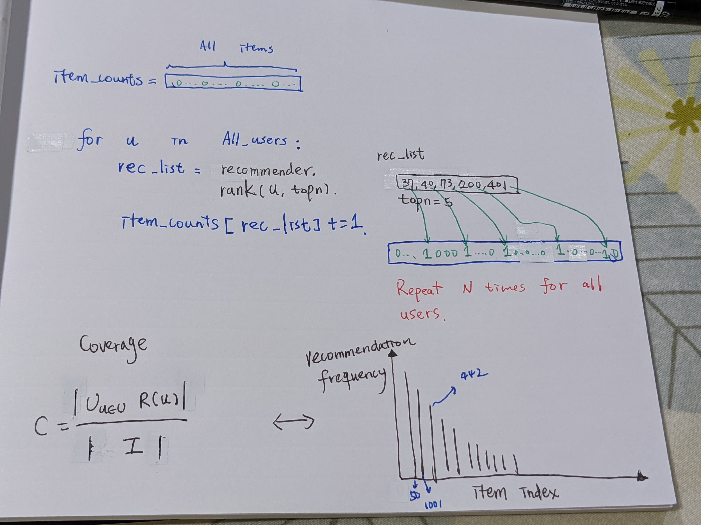
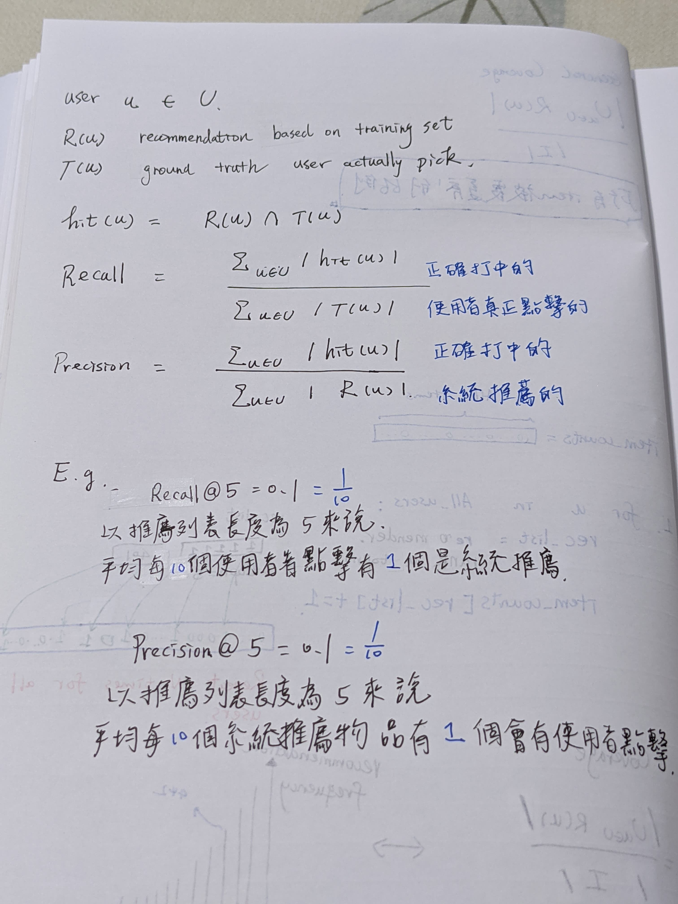

# Reference

[Recommender Playground from yltsai](https://github.com/YLTsai0609/recommender_playground)

[推薦系統實踐 - 項亮 2010](https://github.com/jzmq/book/blob/master/novel/%E6%8E%A8%E8%8D%90%E7%B3%BB%E7%BB%9F%E5%AE%9E%E8%B7%B5.pdf)

# Coverage

內容商應當最在意的指標 - 顯示了所有物品有多少被推薦出去，指標有很多種方式定義，以下是最簡單的一種定義(同時也被使用在`RecModel`中)

</img>

from : 推薦系統實踐

## different version coverage

# Recall & Precision

能夠被離線計算的指標，通常看Recall，來評估在訓練集所收集的時間區段中，平均每$a$個使用者點擊會有$b$個是系統推薦

這兩個指標是以**點擊數量**作為評估標準，容易失準的地方就是有的使用者很愛點擊東西，或是有機器人一直點擊，會把點擊數衝高

</img>

from : 推薦系統實踐

# Hit Ratio

$$
\frac{\#~hits}{\#~users}
$$

$\#~hits$ : 推薦列表N在確實有涵蓋使用者點擊
$\#~users$ : 使用者數量

同Recall，但以使用者數量作為評估基準，單個使用者就算有30個點擊且系統推薦出5個，hits不會是5，仍然是1

[slim 2011](http://glaros.dtc.umn.edu/gkhome/fetch/papers/SLIM2011icdm.pdf)

# AUC
[乱弹机器学习评估指标AUC 570+](https://zhuanlan.zhihu.com/p/52930683)
[【技术分享】六：搜索排序—指标介绍与选择](https://zhuanlan.zhihu.com/p/99268184)

* 幾何觀點 - ROC 曲線下的面積 (True Positive Rate vs False Positive Rate)
* 機率 & 組合觀點 - 給定一個正樣本和副樣本對，在 x % 的比例下，模型對於正樣本的預測分數會高於負樣本的預測分數
  * 實際分數不重要，相對關係比較重要
  * 通常點擊模型的 AUC 低於 購買轉化的 AUC，正負樣本之間的平均 GAP 越大， AUC 就會越大
* 所有的 postive-negtive pair 在計算上是等價的，這可能不實際，例如 userA 和 userB, or sessionA 和 sessionB，解決方案是 group normalized AUC

# 線上線下指標對齊何校正

1. 線下指標要對應到線上指標，產生高相關係數，才可繼續優化 offline metrics
2. 審慎 review training, val dataset，沒有考慮時間時，容易造成穿越
3. 排除 bug，線上線下預測要符合預期