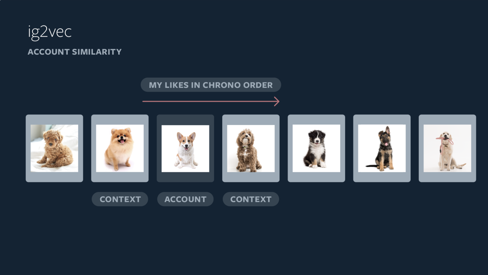

# Integram, 2019

Powered by AI: Instagram’s Explore recommender system

[post](Powered by AI: Instagram’s Explore recommender system)

[post-trainslation](https://yehjames.medium.com/instagram-%E6%8E%A8%E8%96%A6%E7%B3%BB%E7%B5%B1%E4%BB%8B%E7%B4%B9-%E5%88%86%E6%9E%90explore%E6%8E%A2%E7%B4%A2%E9%A0%81%E9%9D%A2%E7%9A%84%E5%80%8B%E4%BA%BA%E5%8C%96%E6%8E%A8%E8%96%A6%E7%AE%97%E6%B3%95-792d03fda228)

# 產業特性

social network(社群媒體)

user - item interaction

1. 一個 user 一天可以看 > 10 篇貼文
2. 和電商不同，電商一個 user 一天不可能買10個商品
3. 和音樂平台的相似處，一個 user 一天可以聽 > 10首歌

# User, Item 特性

* Item 數量 > User 數量
  * item 增長的數量 > user 增長的數量
  * 新 item > 新 user

* 對 user 所知 > 對 item 所知
  * item 文字少，圖片多，限時更多， content 分析成本高
  * 梗圖，梗影，電腦不易判別
  * user 對 item 的互動紀錄很多，一個 user 一天可以看20+則貼文

* user 變化 > item 變化
  * user 興趣變化的速度不會很快，一個user所關注的面向粗估可以以半年~一年才會有變化
  * item 內容推出之後大多不在改變

* user cold start 嚴重性 >> item cold start 嚴重性
  * 新貼文沒人看 --> 請他打廣告，請他加朋友
  * 新使用者找不到自己的興趣 / 朋友 就很嚴重了

小結 : 

1. user 互動紀錄多，興趣變化速度不快，item內容解析成本高，從 u2u2i 下手是好的起手式
2. user cold start 需要關注(找你可能認識的人，你可能喜歡的貼文 - 個人化)
3. user 行為經常屬於長期偏好而不是當下需求 --> latent factor / tagging 效果會很好

# Exlore

功能特性 : 讓 user 挖掘更多他喜歡的、但是不是他有關注的帳號，進而提升使用者黏著度，最終可以提昇貼文 PV 以及廣告收入

metrics : 
1. explore DAU
2. explore PV per user
3. user total time on instgram app

# Candidate Generation

billions --> 500

1. 走 UserCF
3. 貼文url 以及 user 行為作為 token (word)
2. 每個 user 的行為 (for each session) - sentence
3. 每一個 user 在不同 session 可能關注的話題不一樣，所以以session來做切分

4. labels : 人類手標主題
5. features : behavior sequence 
6. output : classification report, word2vec embedding
7. 直接用人標記來快速迭代

</img>

8. approx nearest neighbor (FAISS) to select Top500，similar topic users for each users.

