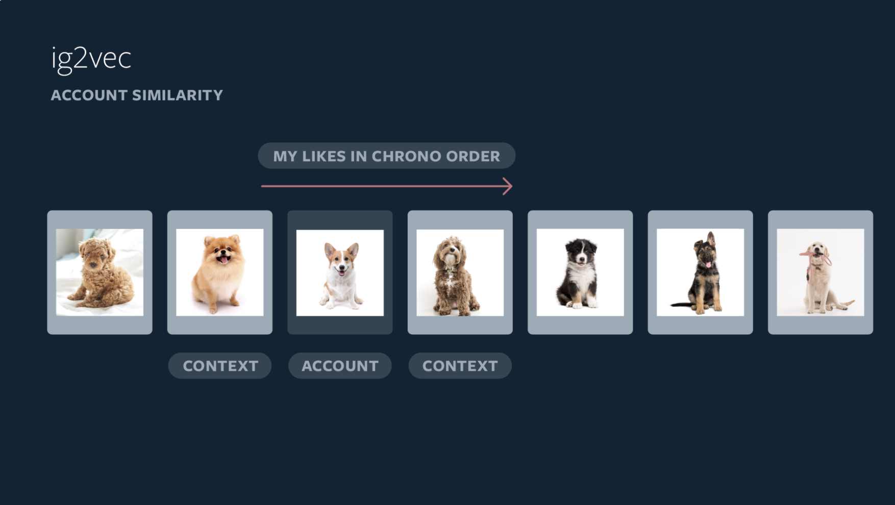

# Integram, 2019

Powered by AI: Instagram’s Explore recommender system

[post - Powered by AI: Instagram’s Explore recommender system](https://instagram-engineering.com/powered-by-ai-instagrams-explore-recommender-system-7ca901d2a882)

[trainslation](https://yehjames.medium.com/instagram-%E6%8E%A8%E8%96%A6%E7%B3%BB%E7%B5%B1%E4%BB%8B%E7%B4%B9-%E5%88%86%E6%9E%90explore%E6%8E%A2%E7%B4%A2%E9%A0%81%E9%9D%A2%E7%9A%84%E5%80%8B%E4%BA%BA%E5%8C%96%E6%8E%A8%E8%96%A6%E7%AE%97%E6%B3%95-792d03fda228)

# 產業特性

social network(社群媒體)

user - item interaction

1. 一個 user 一天可以看 > 10 篇貼文
2. 和電商不同，電商一個 user 一天不可能買10個商品
3. 和音樂平台的相似處，一個 user 一天可以聽 > 10首歌

# User, Item 特性

* Item 數量 > User 數量
  * item 增長的數量 > user 增長的數量
  * 新 item > 新 user

* 對 user 所知 > 對 item 所知
  * item 文字少，圖片多，限時更多， content 分析成本高
  * 梗圖，梗影，電腦不易判別
  * user 對 item 的互動紀錄很多，一個 user 一天可以看20+則貼文

* user 變化 > item 變化
  * user 興趣變化的速度不會很快，一個user所關注的面向粗估可以以半年~一年才會有變化
  * item 內容推出之後大多不在改變

* user cold start 嚴重性 >> item cold start 嚴重性
  * 新貼文沒人看 --> 請他打廣告，請他加朋友
  * 新使用者找不到自己的興趣 / 朋友 就很嚴重了

小結 : 

1. user 互動紀錄多，興趣變化速度不快，item內容解析成本高，從 u2u2i 下手是好的起手式
2. user cold start 需要關注(找你可能認識的人，你可能喜歡的貼文 - 個人化)
3. user 行為經常屬於長期偏好而不是當下需求 

# Explore

功能特性 : 讓 user 挖掘更多他喜歡的、但是不是他有關注的帳號，進而提升使用者黏著度，最終可以提昇貼文 PV 以及廣告收入

metrics : 
1. explore DAU
2. explore PV per user(reading depth)
3. user total time on instgram app

# Candidate Generation (Ig2Vec)

* 1G posts --> 500 posts
* hard to scale domain knowledge -  
  * cross country, race 
  * complex content(images and videos)

1. 走 UserCF
3. 貼文url 以及 user 行為作為 token (word)
2. 每個 user 的行為 (for each session) - sentence
3. 每一個 user 在不同 session 可能關注的話題不一樣，所以以session來做切分
4. features : behavior sequence 
5. output : word2vec embedding(account similarity)
   * 相似的 account 會擁有較近的 L2 distance(而非較相似的物件(圖片、影片))
6. 直接用人標記來快速迭代

* NOTE: `word2vec`,embedding 是從自定義文本所訓練(unsupervised)，但為了快速迭代相似帳號的效果，需要 label data(可抽樣，可能可以控制在 label data < 1K for each `sprint`)

</img>

* 怎麼選標記資料?
  * sol 1 : item tags --> account tfidf tags, filter 出相似 tags 作為相似的 account groud truth

* approx nearest neighbor (FAISS) to select Top500，similar topic users for each users.

* NOTE: why not content-based?
  * IG上有圖片和影音，考慮到如何標記圖片和影音的方法
    * 透過 `tags`
    * 透過 `object detection`, `image classification` 對圖片、影片來抽取標記
  * IG 上的使用者興趣過於廣泛(一個 account 可能有 2~5種興趣)
  * 圖可能是梗圖、或是帶有隱喻意義的圖片，因此直接做物件偵測或是圖片辨識也未必能抽取出正確意義(但 `user click` 可以)
  * 以上方法耗時耗力，且可能效果不好，透過`user click` 來作為圖片、影片的標記會更容易一點(雖然會有 popularity bias)

9. Huristic post-processing
   1.  if like image of `Alice`
   2.  `Alice` --> `Embedding Vec`
   3.  `Embedding Vec` --> `Similar account like Bob, Joe, Alisasa, ...` 
   4. `Collect Bob's content` --> filters(such as Not Safe for Work content) 
   5. `Candidates content`

10. candidates generation as fine-grained relevance item sets.

# Ranking

500 --> 150 --> 50 --> 25

* 越前面計算速度越快
* 越後面的越準

* `treat as classification problem`
* metrics - Precision / Recall / F1

* labels 
  * Like(Positve), Saved(Positive), See Fewer Post Like This(Negtive)
* Value = $w_{like}Pr(like) + w_{saved} Pr(saved) + w_{fewerpost}Pr(fewerpost)$
  * easy to adjust with different business strategy for PM in IG

* NOTE: 
  * Like, Save 可以直接 select
  * see fewer post like this 可以透過 tags(較容易取得) / item embedding(如果過往有做過這份數據 or resnet transfer_learning(受限在梗圖)) 取得
  * Aka 可機制化產生 training data

* features
  * viewer
    * viewer - (dense) behavior sequence embedding
    * viewer <--> author (sparse) interaction features
  * author
    * author - (dense) behavior sequence embedding (以 author 而言，更容易去看其他 author 的圖文，在探索上的推薦也要做類似的處理)
    * author <--> (sparse) image popularity features 該 author 有哪些熱門 (by user clicks) 的圖文
  * images 
    * resnet (embedding) - 圖片裡面是什麼

* Model
  * Multi-task multi label NN (一個 post 可能有多個標籤，中間 embedding 可共用)

</img>

1. 1st pass - distillation model mimics the combination of the other 2 stages, with miminual features, 500 --> 150
2. second pass : lightweight NN with full set of desnse features 150 --> 50
3. final pass Deep NN with full set desnse and sparse features, 50 --> 25

# Application - Explore

* diversity - down rank posts from the same account
* if feed (turn off diversity options)

# Ref

[Is Word2vec a supervised/unsupervised learning algorithm?](https://www.quora.com/Is-Word2vec-a-supervised-unsupervised-learning-algorithm)

[Learn Word2Vec by implementing it in tensorflow](https://towardsdatascience.com/learn-word2vec-by-implementing-it-in-tensorflow-45641adaf2ac)