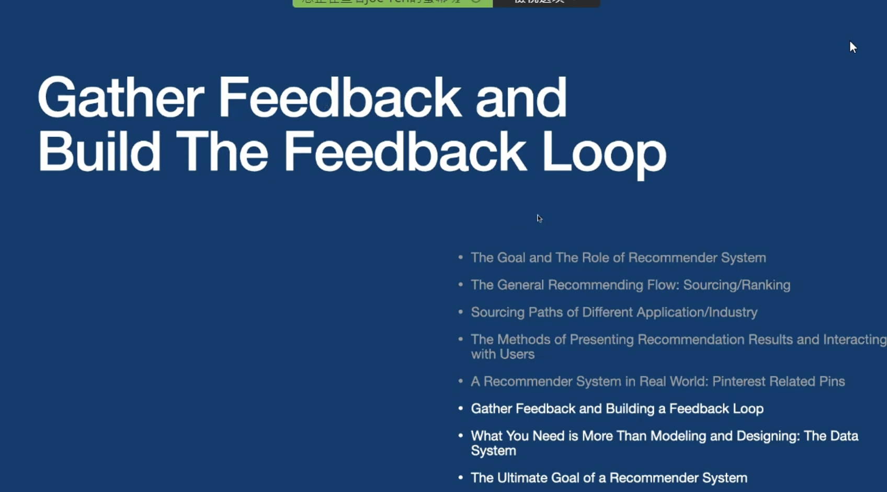

# Ref

[數據 PM 從零開始實刻推薦系統 — ALPHA Camp 資料人才種子計畫](https://medium.com/@peggy.peiying.li/alphacamp-recommendation-system-f5017ca62410)

[0525 Designing Recommender System for Your Application/Industry](https://www.youtube.com/watch?v=06apCo2JSig)

# 熱門推薦

適用商業場景 : 

1. 平台成立初期
2. 商品數不多

商業限制 :

1. 無法推薦長尾商品，可能導致使用者認為平台商品缺乏多樣性

技術特點 : 

1. 技術實作容易

# 協同過濾 - i2i

適用商業場景

1. 相似商品推薦(顆粒度可達最精細)
2. 較能推薦到長尾商品
3. 新商品若缺乏商品profile，會無法被推薦(item cold start)
4. 大部分電商

技術特點

1. user數量遠大於item數量時計算量較低

# 協同過濾 - u2i2i 

適用商業場景

1. 其他使用者也看了
2. 更傾向推薦熱門商品(顆粒度可達最精細)
3. 新商品若沒有使用者點閱，會無法被推薦(item cold start)
4. 內容具有時效性
5. 多樣性相比i2i較低

技術特點

1. 商品數量 >> user 數量時，計算量較低

# 對應商業問題

1. 提升長尾商品業績 --> i2i
2. 培養高忠誠度 user --> UX 問題 --> 請先定義怎樣叫做高忠誠度
3. 提升客單價(popularity, u2i2i, i2i)

# Stackholders

範例：要不要在過幾天的大促上最新版本的推薦系統？

a. 開發部門：新推薦模型的成效還不是太好，且若現在採用，會造成平台系統不穩定，再等待兩個月，準確度及穩定度皆會改善，可達到較好的效益。

b. 業務部門：這次大促的目標是以往的兩倍，不採用新推薦系統的話，不可能達到！

c. 客服部門：用戶最喜歡的就是在平台上可以輕易找到喜愛的商品，若貿然啟用新推薦系統，可能造成用戶因不喜歡而流失。

* TBD

# 0525 Designing Recommender System for Your Application/Industry

* 從產品角度思考如何設計推薦系統

</img>

</img>

* 推薦系統等同於超級業務員
* 一個好的業務員會在和使用者互動的過程中知道什麼是最適合的
  * 能夠透過過去100個使用者的經驗識別出現在新的使用者想要的是什麼  

</img>

</img>

</img>

* 最重要的其實是 Sourcing 得部分，後續的 Ranking 都 deprends on Sourcing，如果根本沒 Sourcing 到，你 Ranking 也沒用

# Sourcing

</img>

* u2u2i - 最經典最老派
  * UserCF - 同溫層喜歡什麼
* u2i2i - 因為電商而出現
  * ItemCF - 物品的受眾如果相似，則物品相似
    * 使用者看的物品 --> 相似物品
* other factor - 不知道為何，反正找得到， ML 常用

</img>

</img>

* 有機會是 SOTA，因為突破了一定要找相似 item / 相似 user

</img>

* Content-based 也是一條路

# What's the best for my applciation

</img>

</img>

</img>

* 8個面向

## Video Streaming : best path !?

* 猜 : 同溫層 !?
* 沒有標準答案，但圈起來的會比較被重視

</img>

* Why?

</img>

* 同溫層沒看過的電影就不知道喜不喜歡 - user cold start in UserCF

</img>

<!-- </img> -->

* 為何 UserCF(u2u2i), u2f2i 會被重視?
* 因為使用者的長期偏好改變的速度較慢
  * 喜歡恐怖片的通常會一直喜歡恐怖片
  * 喜歡獨立電影的通常會一直喜歡獨立電影
* 使用者的興趣不會因為 short-term 需求 (短期意圖) 改變
  * 因為假日、季節就不喜歡恐怖片 - 但確實可能會聖誕節看一些聖誕片，這可以用 trending 補足
* user 期望被同溫層 inspire， usercf 的 diversity 也蠻好的

as the same as IG

</img>

# How about E-commerce?

</img>

</img>

</img>

* u2i is simple and useful
  * 使用者看到商品通常要看到他 7 次，才會決定 buy in
* Netflix : 請繼續收看
  * 商品放在購物車，是否要結帳

* 每次來電商的目的不一樣
  * 今天要買禮物給媽媽
  * 後天要買禮物給爸爸
  * 大後天來買個文具用品
* i2i 是更常態的需求，因為每次來目的不一樣
* **特別是相似風格的篩選**
  * 風格較難用文字描述，也很難用 Tag 表達，使用者點擊成為了很好的資料源
  * 左邊的圖、每個店家上架時對風格的描述就不一致了，用 tag 鐵定死

* 因為意圖容易轉換，因此 Latent Factor / User Tag 很容易 outdate

* Core User Needs Personalization (eaily build on the top of i2i)

* 光譜思考 --> 自己的 Application 更接近 Spotify/Netflix 還是 E-Commerce?

# 推薦系統如何呈現給使用者?

## Netflix

</img>

</img>

* Netflix - 橫 Recommendation x 直 Recommendation

## Spotify

</img>

* Discover - 推薦使用者完全沒聽過的歌給使用者
  * 平台不是只有在乎使用者端，平台是 two-side market，也要在乎內容供應端
  * 同時也希望使用者可以在平台上停留更長的時間
  * 也希望使用者能夠找到他要的
* Radio - 給定一個主題，馬上變一大堆歌單給你

## Pinterest

</img>

* 服務像是剪貼簿，使用者可以收集你喜歡的圖片，創作者可以創作、張貼自己的圖片

* Close up view - 仔細看單一圖片
  * 觸發 single input i2i
* HomePage
  * multi input i2i
* i2i 攻佔了 pinterest 兩個最重要的版面

## Taoboo

</img>

## Medium

</img>

* weekly hilights
* quick reads
* based on your reading histroy
* nest in programming(your interest)

# Related Pins - Pinterest

</img>

* 不同人可以上傳同張圖片，沒關係
* 上傳圖片時填寫標題，給個 link (需要加入 tag 嗎?)
* 使用者可以收集 Pins，該集合叫做 Board
* 一個人可以有多個 Board

Overview of the architecture (2017)

2017 年在 (d)

</img>

[ref : Related Pins at Pinterest:
The Evolution of a Real-World Recommender System](https://arxiv.org/pdf/1702.07969.pdf)

</img>

* Let's focus on Pin-Board Graph

</img>

* Pin-Board Graph
* Insights from co-ocurrences
  * **越常出現在同個 Board 中的 query ， 其 images 越相似**
  * e.g. 黃金獵犬
    * 低度共同出現 - 動物
    * 中度共同出現 - 狗、風景
    * 高度共同出現 - 黃金獵犬、風景
    * 是否共同出現，可作為一個標籤來源 - 這是 insights

</img>

* 把 Graph 整理到 Memory 中，只要 Pin 進來，就 Random Walk 產生推薦， runtime inference 只需要一行 for loop
  * No Training Time，Just index the graph from daily job
  * Only Runtime and walk algorithm
  * 借鑑的方法 - WTF(Who To Follow)
  * 甚至不用 cache

</img>

* 和 content-based 相比 - 非常有效率(快、準)
  * content-based : 較難追求準度，因為沒有使用者 Verify 的資訊
* 一件有趣的事情是， Pinterest 是全世界最大的圖像網站，但不使用圖像本身的資訊做推薦
  * Visual Cand - 意思是如果 Pin 裡面的圖很像，直接共用推薦結果
  * Pinterest 也不使用文字資訊做推薦，雖然使用使用者點擊，但只要該 Pins 有至少被 5 個 Board 收藏，算出來的推薦結果就還行了

</img>

* The embedding neighbor candidates - 依然使用的是 Pin Board interactions

</img>

* 使用者在短時間內如果點擊了 2, 3 張圖片，那麼這兩三張圖片(Pins) 可能很像 --> Pins 2 Vec
  * 因為使用者在短時間內通常有一個明確的目的， e.g. 佈置我家陽台
  * [Also an insights can be verified, post](https://medium.com/the-graph/applying-deep-learning-to-related-pins-a6fee3c92f5e)

* 很不幸的是，收集使用者點擊行為，做 Pin2Vec 仍然不比 Board-Pin Graph Random Walk 的準度
* RandomWalk 通常不需要太大的資料就可以做到很準的推薦
* Embedding 通常需要較大的資料量來支撐

* **很大程度是依賴產品本身的特性來做推薦系統，而不是 Image Feature 怎麼抽，文字 Feature 怎麼抽**

# Gather Feedback & Feedback loop (Build a Raw Data Product)

</img>

</img>

* 兩個關鍵點 - 怎麼收集資料 & 怎麼用資料做一個符合使用者需求的推薦系統
* Pinterest - Pin-Board --> 使用者收集好之後，有推薦系統，又能夠更快幫助使用者發現新的 Pins

## Netflix

</img>

* 從星星數改成按讚跟倒讚
  * Quantity : 給 feedback 的方式更快，整體 feedback 收集量上升
  * Quality : 每個人的三顆星意義不同 - 有些人的三顆星是正面評價、有些人的三顆星是負面評價，星星數的收集方式有 personal bias
* 從星星數改成 x% match

## EC - Amazon, Airbnb

</img>

* Amazon - 書評很豐富，但探勘後發現，有 39% 的評價都是假的(洗評價)

* Airbnb - 如何讓租客和住客能夠互相信任彼此? 評價很重要
  * 具有賽局概念，住客還是會給5顆星，但私下說租屋處不好，不給5顆星自己以後住不到
  * 怎麼 verify ? - 會發現有給5顆星，但不會推薦給其他租客

## Spotify 

</img>

* No more thumb up / thumb down
* 在 Spotify，沒人用讚跟倒讚
* 原本是星星 & 按讚 & 倒讚 --> 直接換成只有愛心

</img>

* 做了什麼才是真正的使用者億圖

# Make your Loop MultiSource

</img>

</img>

* 推薦系統推出後，3年內從推薦系統收集到的 Pins 從 10% --> 40%， 也導致沒有新血的加入
* Multi-Source - 打開 feedback loop =)

* 而新的結果很難打贏舊的，因為基本上新的 items 使用者沒看過 (Evaluation dataset is biased)

## More than Modeling and Designing : The Data System

</img>

</img>

</img>

slide 3 start: 0:32
slide 4 start: 0:57
slide 5 start: 1:58
slide 6 start: 2:44
slide 7 start: 3:50
slide 8 start: 4:12
slide 9 start: 6:18
slide 9 ends:  7:25

https://www.youtube.com/watch?v=06apCo2JSig
