# Over-Parameterization

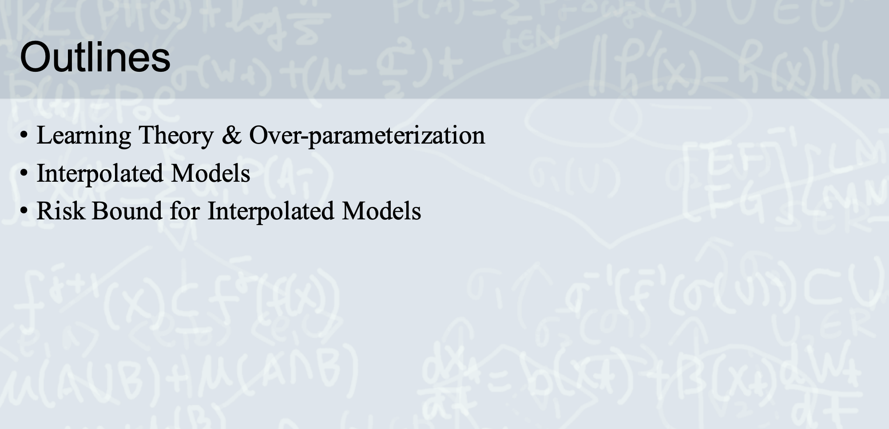</img>

Basically, we'll foucs on the deep learning foundation(like machine learning foundation)

The Interpolated Model - the models which has infinite model complexity.

Why it is useful when doing deep learning?

The deep learning model usually has infinity model complexity!

The researchers are still digging for analytics approach to explain why deep learning can work, what's the limitation, how to predict the behavior of DL models from mathematical theorem.

They called the infinity model complexity model **Interpolated model**, and **Over-Parameterization** for the model fit some conditions break the rule of VC-dimension.

The problem os VC-bound : It is too easy to match(too loose).

We have differenct aspect to analyze the problem.

1. from Information Theorem.
2. from Neural Tangent Kernel(for two layer fc nn).
3. from PAC Bayesian Bound(for stochastic model).
4. from Interpolated Model - **today's topic**

There is still not a uniform theorem to describe the deep learning behavior from now on(2021, Jan). Let's wait and see......

# Learning Theory

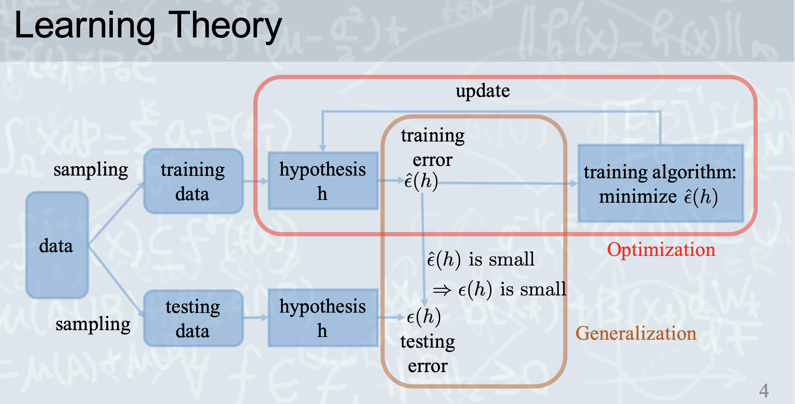</img>

1. Training data and testing data samples from the same distribution(i.i.d)
2. How to use a algorithm make $E_{in}$ is small enough?(Optimization)
3. How to make sure $E_{in}$ samll makes $E_{out}$ is small, too? -> the statisical guarantee(Generalization)

# Generalization

Old theorem 

Over-fitting is caused by high VC Dimension(high model complexity)

The VC theorem stats : 

the upper bound of testing error is :

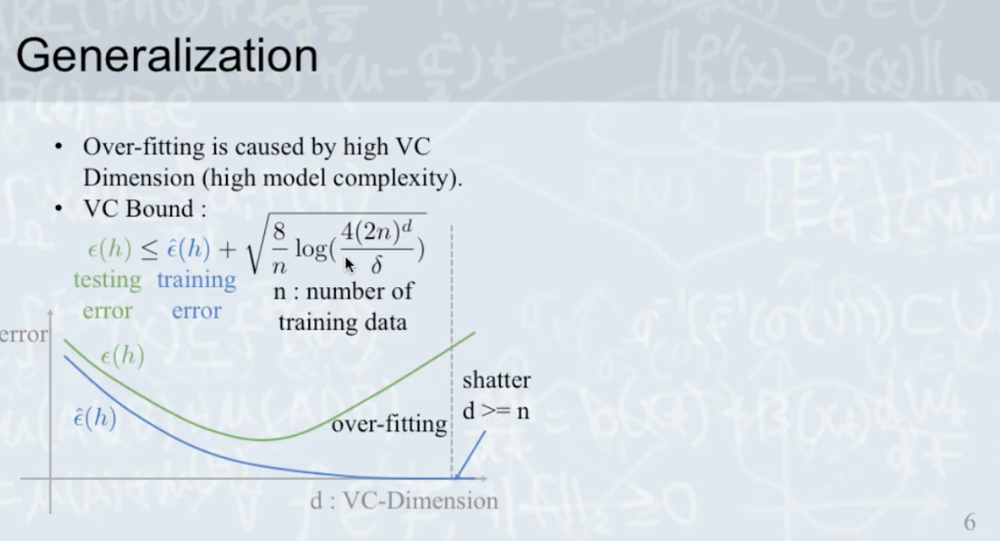</img>

1. $n$ plays data diversity, n should be larger than d so that VC bound is small.
2. $d$ >> $n$, then we have a shatter(high VC bound)

   * shatter means the model can perfect fit the training data. (but the hypothesis might not fit testing data). 

3. please review the vc-bound from ML-foundations.

## NN

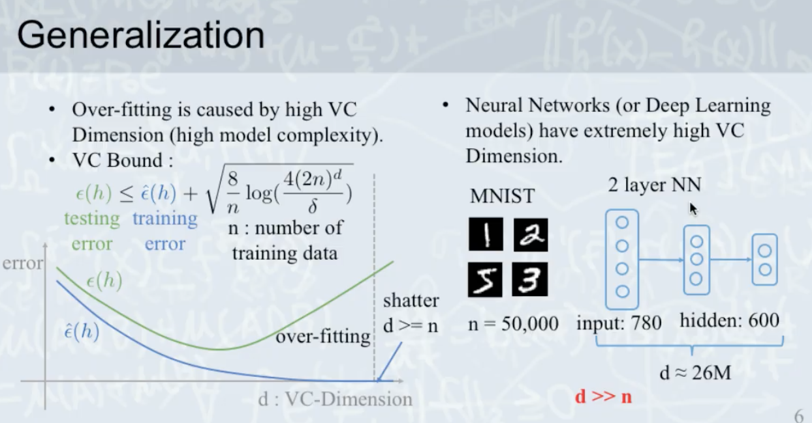</img>

$d$ >> $n$ 

shatter and overfitting? 

but that's not the fact.

# Over-Parameterization

paper : Rethinking Optimization and Generalization.

We have experiments:

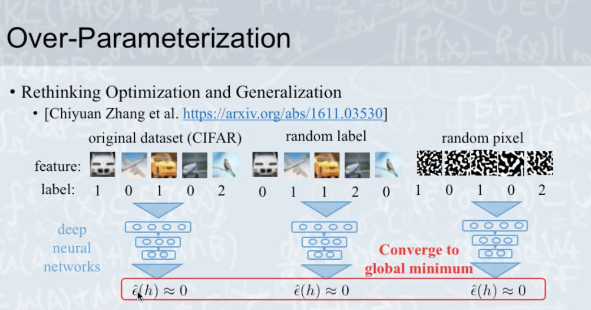</img>

How about the generalization?

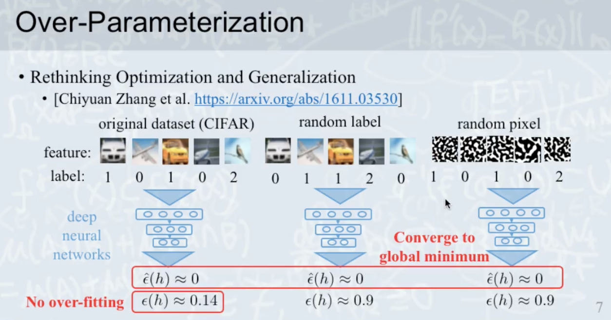</img>

Looks good, but why?

## the data

We foucs on **data**

| data     | error | note  |
|----------|-------|-------|
| original | small |  |
| random   | large |  |
| noise level    | large | for reference |

## Noise level?

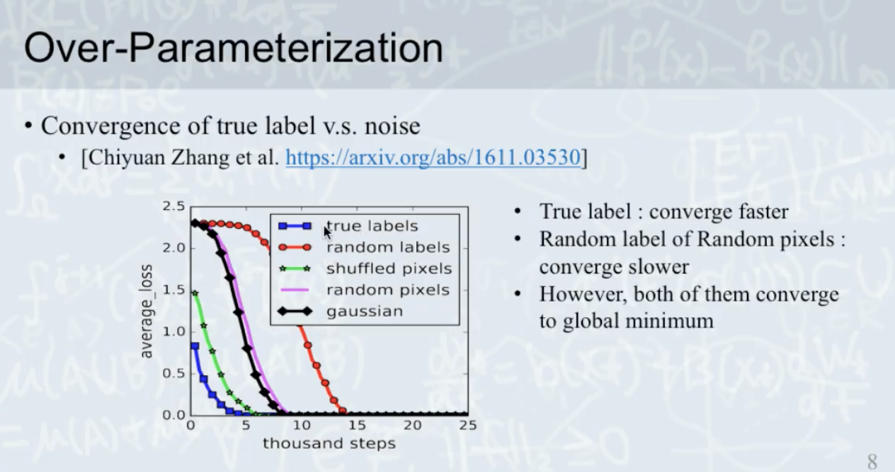</img>

Conclusion : 

Noise hurts deep nn model(actually, hurts all ml model...)

## Generalization curve of Over-Parameterization model 

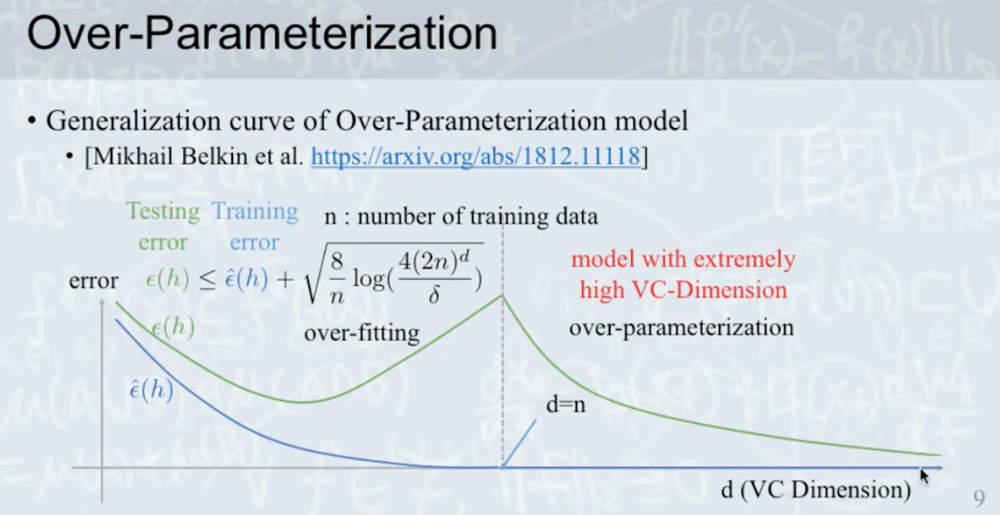</img>

## Interpolated Model

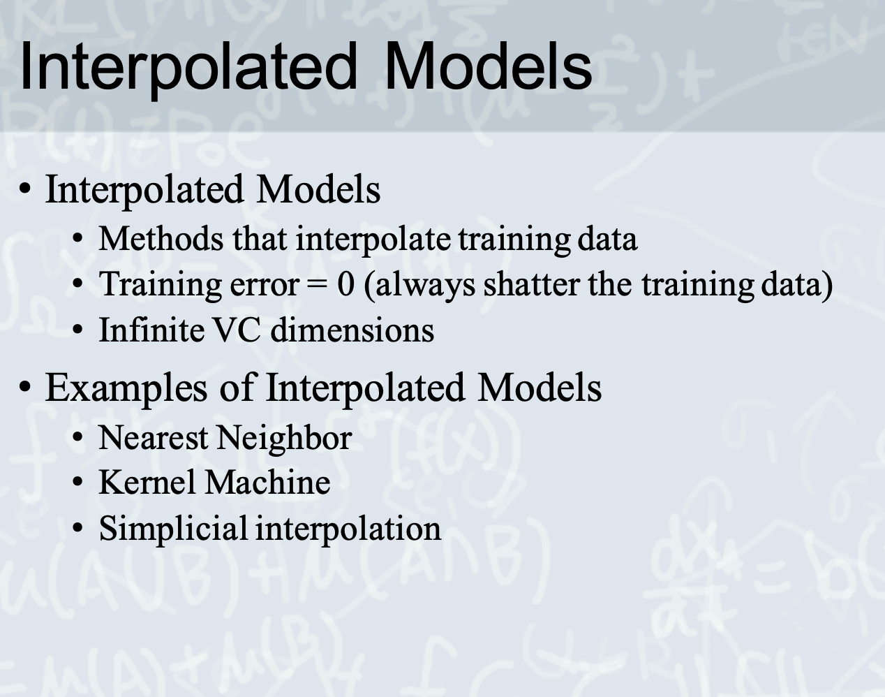</img>

1. KNN(k=1)，recognize all the training data，model conmplexity = infinity.

2. Kernel Machine - treat every single training sample as one kernel, model conmplexity = infinity.

3. today's topic.

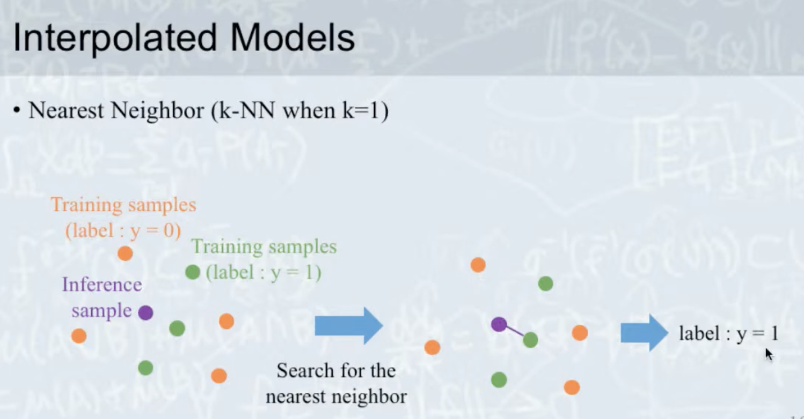</img>

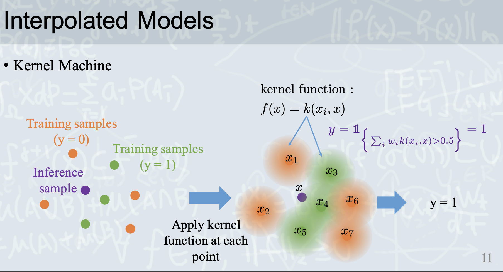</img>

Kernel function is a function to get a value based in data(in this case, the behavior just like knn, n=1)

## Simplical Interpolation

1. get inference sample
2. find 3 nearest sample(to construct a simplex)
3. construct a vector basis from simplex
4. get the coordinate value of the inference sample in the simplex
5. inner-product the coordinate and the label ground truth.
6. do the filter (in this case, threshold = 0.5)

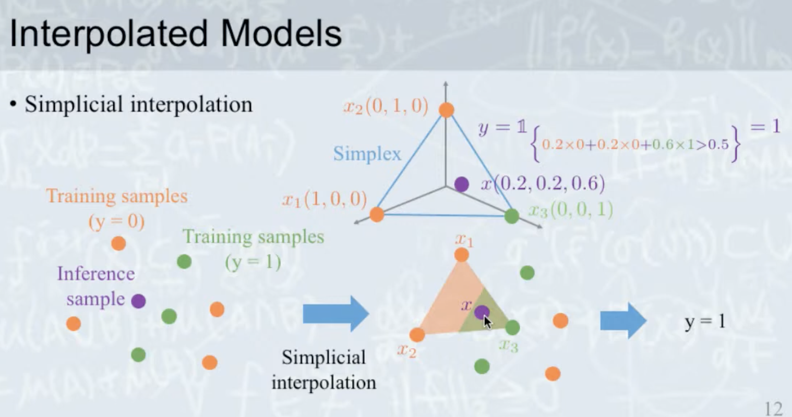</img>

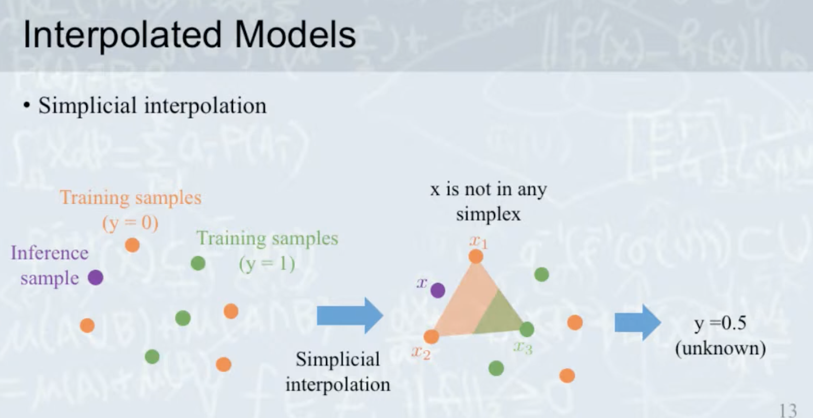</img>

We might get some case which the inference sample is outside the simplex. and value = 0.5, we marked that as unknown.

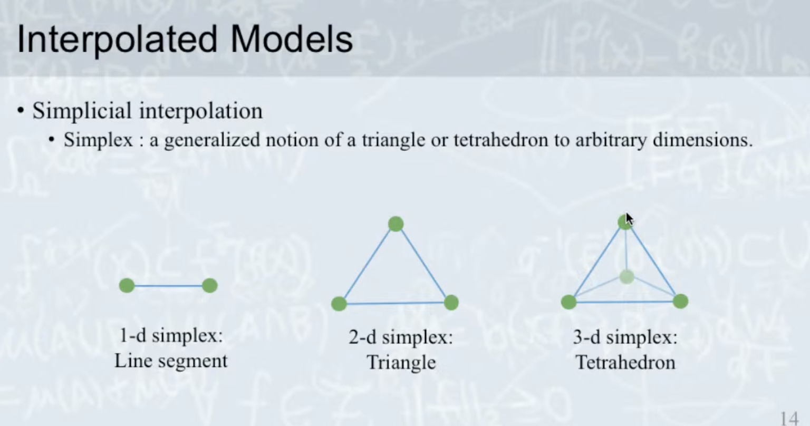</img>

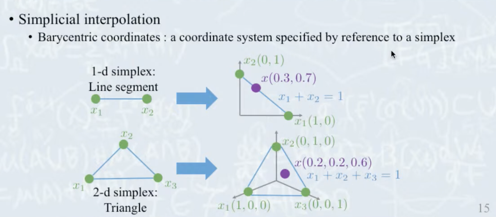</img>

Simplical Interpolation could be used in arbitrary dimensions.

# Risk Bound for Interpolated Model

https://www.youtube.com/watch?v=ks4W9Ze5rOg

TODO 26.32

# Misc

# Papers

1. Rethinking Optimization and Generalization

2. [Overfitting or perfect fitting? Risk bounds for

classification and regression rules that interpolate NIPS 2018](https://papers.nips.cc/paper/2018/file/e22312179bf43e61576081a2f250f845-Paper.pdf)
