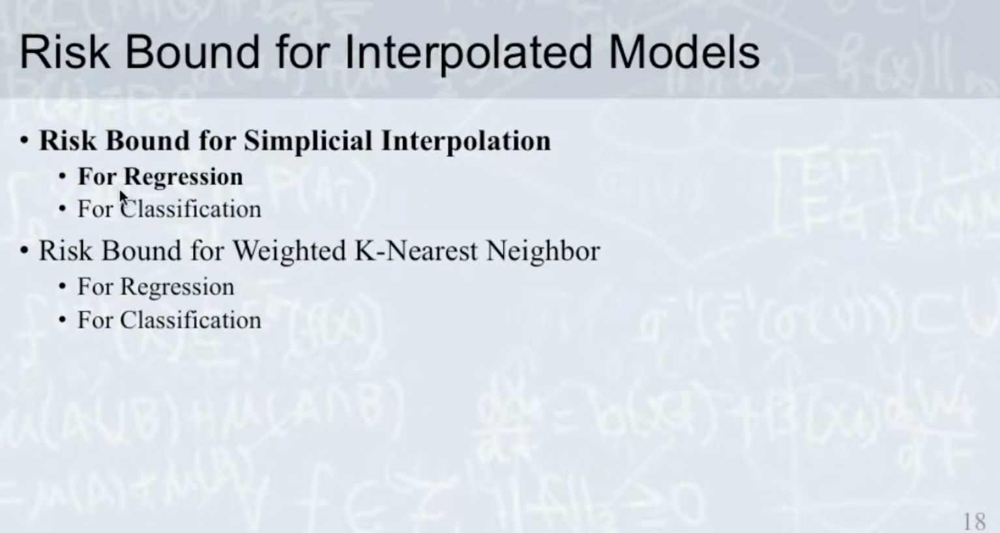

# Over-Parameterization

</img>

Basically, we'll foucs on the deep learning foundation(like machine learning foundation)

The Interpolated Model - the models which has infinite model complexity.

Why it is useful when doing deep learning?

The deep learning model usually has infinity model complexity!

The researchers are still digging for analytics approach to explain why deep learning can work, what's the limitation, how to predict the behavior of DL models from mathematical theorem.

They called the infinity model complexity model **Interpolated model**, and **Over-Parameterization** for the model fit some conditions break the rule of VC-dimension.

The problem os VC-bound : It is too easy to match(too loose).

We have differenct aspect to analyze the problem.

1. from Information Theorem.
2. from Neural Tangent Kernel(for two layer fc nn).
3. from PAC Bayesian Bound(for stochastic model).
4. from Interpolated Model - **today's topic**

There is still not a uniform theorem to describe the deep learning behavior from now on(2021, Jan). Let's wait and see......

# Learning Theory

</img>

1. Training data and testing data samples from the same distribution(i.i.d)
2. How to use a algorithm make $E_{in}$ is small enough?(Optimization)
3. How to make sure $E_{in}$ samll makes $E_{out}$ is small, too? -> the statisical guarantee(Generalization)

# Generalization

Old theorem 

Over-fitting is caused by high VC Dimension(high model complexity)

The VC theorem stats : 

the upper bound of testing error is :

</img>

1. $n$ plays data diversity, n should be larger than d so that VC bound is small.
2. $d$ >> $n$, then we have a shatter(high VC bound)

   * shatter means the model can perfect fit the training data. (but the hypothesis might not fit testing data). 

3. please review the vc-bound from ML-foundations.

## NN

</img>

$d$ >> $n$ 

shatter and overfitting? 

but that's not the fact.

# Over-Parameterization

paper : Rethinking Optimization and Generalization.

We have experiments:

</img>

How about the generalization?

</img>

Looks good, but why?

## the data

We foucs on **data**

| data     | error | note  |
|----------|-------|-------|
| original | small |  |
| random   | large |  |
| noise level    | large | for reference |

## Noise level?

</img>

Conclusion : 

Noise hurts deep nn model(actually, hurts all ml model...)

## Generalization curve of Over-Parameterization model 

</img>

## Interpolated Model

</img>

1. KNN(k=1)，recognize all the training data，model conmplexity = infinity.

2. Kernel Machine - treat every single training sample as one kernel, model conmplexity = infinity.

3. today's topic.

</img>

</img>

Kernel function is a function to get a value based in data(in this case, the behavior just like knn, n=1)

## Simplical Interpolation

1. get inference sample
2. find 3 nearest sample(to construct a simplex)
3. construct a vector basis from simplex
4. get the coordinate value of the inference sample in the simplex
5. inner-product the coordinate and the label ground truth.
6. do the filter (in this case, threshold = 0.5)

</img>

</img>

We might get some case which the inference sample is outside the simplex. and value = 0.5, we marked that as unknown.

</img>

</img>

Simplical Interpolation could be used in arbitrary dimensions.

# Risk Bound for Interpolated Model

</img>

</img>

Since the mathematical analysis for weighted knn is too complicated. we'll talk about the regression case for Simplical Interpolation.

Regression case also fit the classification case. Just give a threshold. The mathematical analysis is yhe same in this paper.

</img>

$(X, Y)$ represents the random variable of the Population.

$(x, y)$ represents the sample instance by sampling drom population.

we scale the $y$ values in to $[0.1]$ for a finite regression(more easy for mathmatical analysis). 

</img>

The bound and assumption.

## Geometrical picture of the motation

Suppose for 1-dimensional $X$

</img>

$\mu$ represent the possible value-band of $X$

</img>

$\eta (x) = E[Y|X = x]$ represnet the mean of distribution $X$. **also represnts the theorical distribution of $X$**

$\nu (x) = Var[Y|X = x]$ represnet the variance of distribution $X$.

</img>

$\hat{\eta} (x)$ represnet the hypothesis distribution drived from training data.

In our geomatric picture, we can see that if we get more data.

$|\eta (x) - \hat{\eta} (x)|$ will be smaller.

</img>

</img>
$\hat{\delta}_{T}$ - the maximum edge of the triangulation $T$.

$\hat{C}$ : convex hull, the area of $T$.

The simplex is always a convex(凸多邊形), so the $\hat{C}$ is always a convex hull.

## Assumption

</img>

full-dimension - the dimension of $\mu$ is the same as $R^{d}$, which is $d$.

compact - closed and bounded(means the edge is not open, the area is not infinite.)

The properties above should be found in topology(拓墣學).

</img>

Only the left part $\mu$ matches the assumption.

</img>

smoothness-condition : 

We use a high level concept to demonstate it.

You can treat this condition define the slope should be smooth, not too sharp, or rapidly changed.

The property above should be found in real-analysis(實分析).

</img>

So the 

   $\mu(x)$ - the theoretical distribution.
   
   $\nu(x)$ - the variance of theoretical distribution.

should be smooth, unlike the discontinuity(the slope goes to infinity).

## Risk bound

</img>

$E[(\hat{\eta(X)} - \eta(X)^2]$ - the variance of prediction and theoretical distribution.(a.k.a generalization)

if $E[(\hat{\eta(X)} - \eta(X)^2]$ is big means overfit/underfit. 

$E[(\hat{\eta(X)} - \eta(X)^2]$ is small means perfect git.

However, we are talking about Simplical Interpolation, the model complexity can be infinity.

So we are talking about the overfitting case.

The upper bound consist of serveal terms. they represent some property of the data.(Since the model complexity already goes to infinity)

### First term

</img>

teminology : 

1. $R^{d} / \hat{C}$ - the space difference $R^{d}$ minus $\hat{C}$.
2. $\mu(R^{d} / \hat{C})$ - the space difference $R^{d}$ minus $\hat{C}$, also in the $\mu$

which means the other space in the possible $X$ value band(red area)

we can observe that. the yellow area is bigger, the red one is smaller.

This means we need to collect the maximum data diversity matches production scenerio.

Also, the values in red area (there is no data). prediction should be less accurate. we can see the orange line is far away from the purple one in the red area.(left picture)

On the other hand, the red area in the right picture is smaller. the orange curve is closer to the purple one. this one fits better.
s

### Second and third terms

</img>

Since there is a $\hat{\delta}_{T}$ in both the second term and third term, we explain them together.

$\hat{\delta}_{T}$ : the maxmum diameter of the simplex.

if your data cover the possible value band more uniformly : $\hat{\delta}_{T}$ will be smaller. which makes $\hat{\eta}(x)$ fit better(the right figure)

on the other hand, if your data cover the possible value band more unbalanced :  $\hat{\delta}_{T}$ will be larger. which makes $\hat{\eta}(x)$ fit worse(the left figure)

This means a lot when we are collecting data.

1. figure out the production scenario as clear as possible.
2. make sure the data collection procedure represent the sampling of the production scenario(not partially). This always happens in the medical image(very easy to get image from healthy person but difficult from the sicked person.)
3. sample your data by a stratified sampling flavor makes your training data more uniformly to decrease $\hat{\delta}_{T}$ 

</img>

How about the $A$?

$A$ represent the smoothness condition.

Large $A$, the $y$ value change a lot when $x$ change a little bit. - this makes model harder fitting your data.(Left figure)

On the contrary, smaller $A$ menas $y$ value change samller when $x$ cjamge a little bit. - this makes model easier fitting your data.(right figure)

The real-world example like the financial market. 

If you wanna to predict a miniute-lvel prediction / second level-prediciton. It change strongly. It's harder to predict.

But if you wanna predict a long term trend. It will be easier!(but the general feature in the financial market might be very hard to find......)

## forth term

</img>

$E[\nu(X)]$ is the variance of theoretical distribution.

There are two possible scenario make the $E[\nu(X)]$ larger : 

1. noise.
2. you feature and your target is not correlated.

   1. your feature is bad.(build new one or exract new feature from it)
   2. labeller do something wrong with the data(build a label standard and label evaluation).

smaller $E[\nu(X)]$ - easier fitting(right figure)

larger $E[\nu(X)]$ - harder fitting(left figure)

This give us the insight that make sure your noise level is low enough, and you need find new feature/extract feature from your raw feature!

# What we get from the risk bound?

How to prepare your data?

1. Training data should cover your production scenario.
2. Training data should be properly distributed within the space of your production scenario.
3. Labels should be correlated with input features.
4. The flutctuation of labels with respect to input feature should be small.
5. The noise in input feature and labels should be small.

# Connection to NN

</img>

NN is basically with infinite model complexity. 

This bound give us another way to improve our model performance from data.

# Next topic

[Explaining the Success of AdaBoost and Random Forests as
Interpolating Classifiers](https://www.jmlr.org/papers/volume18/15-240/15-240.pdf)

# Misc

# Papers

1. Rethinking Optimization and Generalization

2. [Overfitting or perfect fitting? Risk bounds for classification and regression rules that interpolate NIPS 2018](https://papers.nips.cc/paper/2018/file/e22312179bf43e61576081a2f250f845-Paper.pdf)
