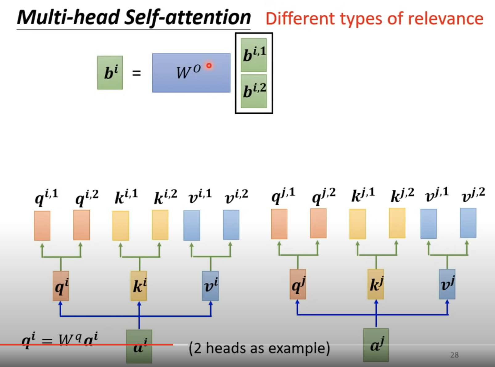

[【機器學習2021】自注意力機制 (Self-attention) (上)](https://www.youtube.com/watch?v=hYdO9CscNes)

[【機器學習2021】自注意力機制 (Self-attention) (下)](https://www.youtube.com/watch?v=gmsMY5kc-zw)

[【機器學習 2022】各式各樣神奇的自注意力機制 (Self-attention) 變型](https://www.youtube.com/watch?v=yHoAq1IT_og)

* 截至 2022 為止

# Complex Sequence (Set of Vectors) Problem Framing

至今為止 
* input 只輸入一個向量 
* model
* output - scalar (regression) or class (classification)

如果輸入的是一排向量，而且數量會變呢?
P.S. 圖像的輸入是固定長度的向量，序列則否

</img>

1. NLP Problem - input as a sequence of vector

</img>

2. Sound - 每個時刻會產生一個 vector, 取樣1秒則有 100個 vector

</img>

3. social network / 分子結果 , each node as a vector

</img>

</img>

Output

* 每個 Vector 都有一個 label
  * Sequence Labelling (POS Tagging in NLP, will each node buy or interest with specific product)

* 所有 Vector --> 一個 label
  * Setment Analysis (情緒分析)
  * 給定一坨分子，有毒性嗎?
  * 給定一坨語音，語者是誰?

* 所有 Vector --> 不知道要輸出多少 label
  * seq2seq, 最著名的就是語言翻譯 / 語音轉文字

</img>

</img>

# Attention

Sequence Labelling Problem

</img>

* FC Layer 可以解決嗎? - I saw a saw, 第一個 saw 和 第二個 saw 沒道理輸出不同的結果
* 用 Window ? (like 1D CNN)
  * Window size 必須握作為一個 parameters，而且 Sequence Labelling 的問題， Input Sequence 的 Token 數量是可變的，參數難以寫死
* 一個網路基本運算 (Attention) ， 能夠解決這個問題

</img>

* 為何稱作 self attention，因為 attention 機制只作用在自己這一條 Sequence (Sequence 會被表示成一個 Matrix, 每一個 Token 會是一個 Vector)
* 而 Attention is all you need 將 attention 這個結構 + FC 取了一個很帥的名字叫做 Transformer ，把它發揚光大 (2017~2024 有 118k citizations)

</img>

</img>

計算 Attention 的方法很多， dot-product 是最常用的，因為矩陣相乘昔當方便，也被 Transformer 發揚光大

</img>

* a --> attention scores
* attention score 不一定要用 softmax 做 normalization, 也可以用 relu，有的論文做出來還比 softmax 好一點，但一般來說做 加總為1 的 normalization 會有比較好的性質

</img>

* 只要有 Q, K, V 其他都是已知 (dot product, get next layers outputs)

</img>

# Multi-Head Self Attention

</img>

* relavance 可能有不同種關聯，所以每一個 head 是一種關聯

# Postiional Encoding

* self-attention 的數學機制，第一個位置和第三個位置的計算沒有差別
* 但舉例 POS Tagging - 動詞通常不會再句首
* Buy behavior - 通常不會出現在 User Browsing 的一開始

</img>

* Transformer is all you need, 手動設定的， sequence lenth as column vector
* 用 Sin, Cos 做 hash, 也有一堆其他方法，目前還是待研究的問題之一 (2021)

</img>

# Applications

</img>

</img>

* 語音轉文字 - Attention Matrix 的儲存量是 sequence^2， 語音的 sequence 太長了 - truncated self-attention (怎麼 truncated, 人為設定參數，取決於你對問題的理解)

</img>

Image as tensor (3*5*10) - 3為向量 RGB, 50個向量 - 輸出  classification --> 類比於 sequence labelling

## Self-Attention vs CNN

</img>

</img>

* CNN 是小的窗口， Attention 是整張圖， aka CNN 是 Self-Attention 的特例 (2019, Nov)
* CNN 是簡化版的，有先驗知識的 Attention
* Attention 是複雜版的 CNN，甚至不是正方形， Attention 會決定 learnable receptive field 有多大
* CNN 參數量少，先驗知識使用得當，速度會更快，模型會更小
* Attention 參數量多，可以學習到更大更複雜的 Pattern，速度也會變慢，模型更大，但可能更準，資料量非常多時，可以考慮

</img>

* 所謂資料量比較，Google 認為是 10M，資料量大， Google 認為是 300M
* 由於圖片會太大， Google 將圖片切成 16塊 patch，每一個 patch 在 label 成一個數字
* ConFormer - CNN + Self-Attention

# Self-Attention vs RNN

</img>

RNN 基本上已經被淘汰，RNN / Self-Attention 做的事情都是 seq2seq

* RNN 需要從 Memory Vector ， 依序接收 sequence 並產生 hidden weights
* 單向 RNN 只看得到最前面， 雙向則是都看得到，但就算是雙向
* RNN 依序輸入 sequence，中機的 transform 太多，甚至資訊可能會被忘記或是扭曲
* RNN 由於算法的設計，一定得等前一個 Block 計算完，所以沒辦法平行計算，這使得訓練速度變得很慢，模型沒辦法很大

</img>

</img>

</img>

Self-Attention 也可以變成 RNN (2020, June)

# Self-Attention in Graph

</img>

Graph 的資料結構除了 Node ， 還有 Edges ， 所以 Attention 可以基於 Edges 是有用的假設，直接從 Edges 裡面開始，其他的都不用做，做到大量的 Pruning 以及 Initialization

* Edges 往往是透過該 Domain knowledge 得到，如果相當可性，那會是非常好的輸入
* 而這種應用方式也是 GNN 的子集合

# Self-Attention 的缺點

</img>

* Q, K, V 3個矩陣，可能還要 Multi-head，計算量非常大， Training 可能沒有問題，但 Inference 可能有問題，如何降低 Self-Attention 的計算複雜度或者 Pruning ， 是未來的研究重點
* Self-attention 容易和 Transformer 直接掛鉤，但是其實 Transformer 不等於 Self-attention ，後續的改進也很容易稱作 xx former

# Self-Attention 的其他改進

</img>

O = VA

or O = V K^T Q

Attention Matrix 的大小正比於 sequence N^2

**你的 bottleneck 真的在 Self-Attention Layer 嗎**

</img>

Transformer block = (Multi-Head Attention + FeedForward Network) * L次

* 也有可能是 FC 耗費資源過多，或者整體 Block 重複次數太多
* Self-Attention 運算量和儲存量取決於輸入序列長度，所以第一坡改進都是用在影像上

# Skip Some Calculation with Human Knowledge

* Local Attention / Truncated Attention
  * 不一定每次都要看 global，可以看鄰近一點就好 (cnn?)
* Stride Attention
  * 跳k格看
* Global Attention 
  * local attention, 有些 token 要看 global attention (整個 sequence 都要看)
  * 每個句子會加上 special token，每個句子都會看，都是每個 token 只看 local
* Different Head use different attention
  * Longformer = local attention + stride attention + global attention
  * bigbird = longformer + random attention !?

</img>

</img>

</img>

</img>

</img>

# Can we only focus on Critical Parts?

* 很小的值直接給0，哪一些值比較大
* Clustering - Query, Key 都做 clustering (Reformer / Routing Transformer)
  * q,k 屬於同個 cluster --> 距離夠近，內積會比較大，需要詳細計算
  * q, k 屬於不同 cluster --> 距離比較遠，直接設為沒有 attention, 補 0
  * cluster 透過 ANN， 會比較快

</img>

</img>

</img>

* 有沒有不基於任何前提假設，直接學習 Attention Matrix 的方法?
  * Sinkhorn sorting network - 直接讓 attention matrix 用學的 (這樣真的有比較快嗎?)

</img>

# Do we need full attention matrix

* 我們真的需要 N * N ? - Attention Martrix 還有 Low Rank - 其他 Column 其實是某些 Column 的 Linear Combination
* Attention Matrix --> AM - basis
* 怎麼選出有代表性的 Attention basis

</img>

</img>

</img>

# Change Martrix Multiplication to reduce comeplxity

</img>

</img>

</img>

* 先忽略 softmax， O_d'n = V_d'N * K^T_Nd * Q_dN
  * 先做 K^T Q - 要做 N d N 次乘法運算，總共是 (d + d') * N ** 2
  * **先做  V K ^T - 要做 d' N d 次乘法運算，總共是 2d'dN 次乘法，只剩下線性**

</img>

</img>

* sorftmax 要放回來，只要可以解開這個式子就行

</img>

* 看待 Self-Attention 的另一個方式
* Generate Templates (KV), Query * KV --> Template Selection

</img>

* exp(qk) 怎麼近似成 f(q), f(k) - Efficent attention, Linear Transformer, Random Feature Attention, Performer

</img>

# 一定要 Q & K ? - Synthesizer

* Attention Matrix 直接用學的
* Input Sequence 和 Attention Matrix 脫鉤，所有的 Sequence 都用一樣的 Attention Matrix

</img>

# Attention - Free ? 

</img>

# Summary

* y軸 - eprformance, x軸，推論速度
* transformer
* Linear Transformer, Performer - 線性複雜度，速度最快，但其實會有 Tradeoff

</img>