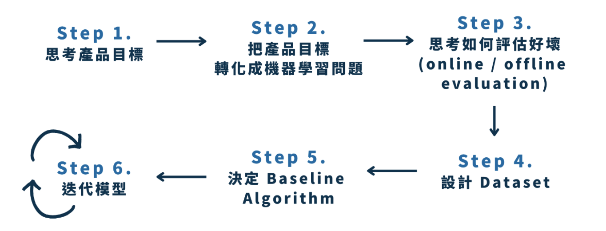
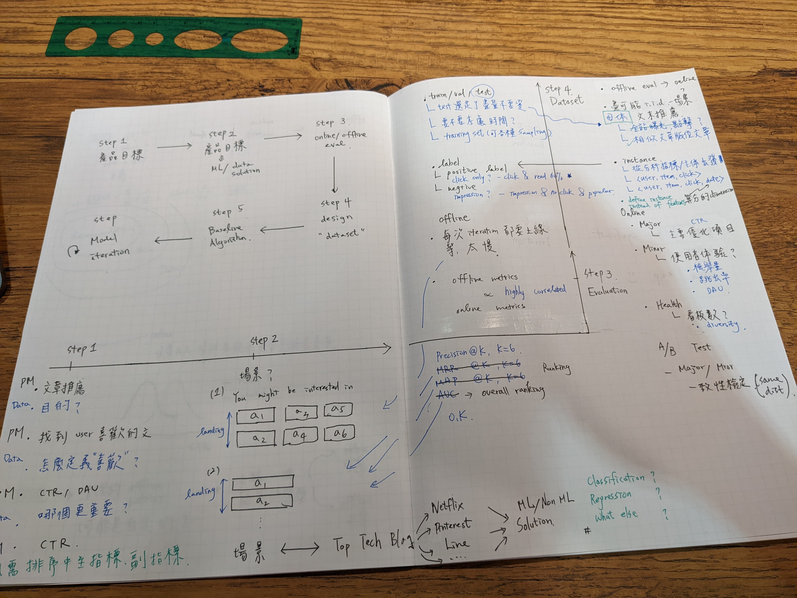
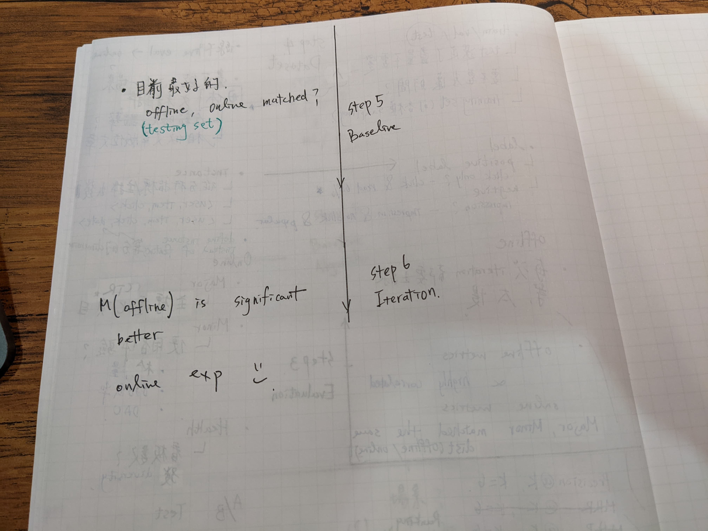

# Why this

標準化、有信心的作業流程，可以加速模型開發的推進

效果 : Dcard ML Team - 2020年做了10來個線上模型實驗 - 2021年做了超過 150 個線上模型實驗

offline 機制必須非常有信心，才能讓整個產品運轉跑的這麼快

</img>

## Step 1 Business Metrics, Prioritizeing Metrics

* PM <---> Manager : 重點是可能會有多個指標，要排序出一個，並確定該指標確實可以達成商業目標

## Step 2 Metrics --> ML Solvable

1. 場景為何? --> 這很重要，不要亂套 SOTA，並歸納情境
2. 世界級大廠怎麼做? Netflix, Pinterest, Spotify, Top Conference Paper, ... 找靈感、找解法， such as
   1. classification for recommendation sys.
   2. sequernce prediction.
   3. graph based 
   4. some methods from EDA.

## Online / Offline evaluation

### online metrics
   1. 主指標 --> 直接優化的目標，比如 CTR
   2. 次指標 --> 使用者體驗相關指標，比如文章檢舉量，DAU (或其他對產品來說重要的指標，但是不比主指標重要)
   3. 健康指標 --> 是產品相關指標，但相對來說並不是那麼重要，主要是輔助我們去觀察主要目標的細節，例如我們會關心曝光看板數，給使用者看到的東西夠不夠多元，不要都是某看板或類型的文章

### offline metrics --> hardest，should correlated with online metrics

**一個好得現下指標要跟線上指標的成長對的上來，這個 offline metrics 酒能夠確實加速模型推進，因為如果每次都要線上實驗，等個好幾天，才能收集到足夠的統計數據，那麼整個開發進程就會很慢，而且做起來也很像在瞎猜，2020年 dcard 只做了 10 來個線上模型，而在 2021年就做了超過 150 個線上模型相關的實驗，就是這個原因**

   1. testing set 的主指標以及次指標(例如兩個)，必須在統計檢定上一致 (一致性檢驗，確保 offline testing set 和 online 的資料是一模一樣的)，如此一來可以得知，testing比較好，上線一定會比較好
      * Q : 直接拿上線後的歷史資料作為 Testing set 不行嗎 ?
      * A : 那麼第一波模型上線之前呢?

</img>

</img>

# Ref

[Dcard 機器學習指南 (II) — 機器學習專案的技術規劃](https://medium.com/dcardlab/dcard-%E6%A9%9F%E5%99%A8%E5%AD%B8%E7%BF%92%E6%8C%87%E5%8D%97-ii-%E6%A9%9F%E5%99%A8%E5%AD%B8%E7%BF%92%E5%B0%88%E6%A1%88%E7%9A%84%E6%8A%80%E8%A1%93%E8%A6%8F%E5%8A%83-536081dcb245)

