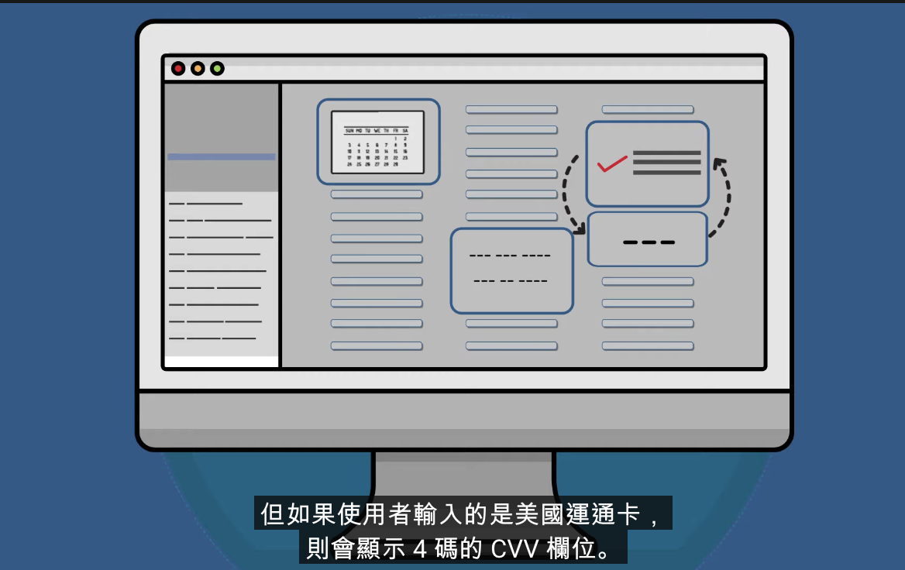

# Why this

1. 協助量化每個 Spring 的工作量
2. 如此一來就能夠定義開發團隊每個 Spring 的開發能量是多少個 Story point
3. 讓開發團隊能夠以 `可持續性的步調` 進行開發
4. 讓 PM 有談判的籌碼

https://www.youtube.com/watch?v=VsSaolMtkKU

1. 點數的絕對值不重要，相對值重要，例如(2的意義是所需耗費的心力是1的2倍)
2. Story point 是描述一個 user story 所需耗費的心力，有三個要素

**工作量**

</img>

1. 都只有一個輸入框，只能輸入一些簡單的字
2. 右邊雖有100個輸入框，但不存在框框之間的交互作用，也只能輸入一些文字
3. 也沒有其他風險
4. 唯一的差別，就是有更多的框框
5. 然而，故事點不應該是100倍，但可能會是2, 3, 5 甚至 10 倍

**工作中的風險及不確定性**

1. 如果開發團隊被要求要估計 story point，但需求不夠明確導致無法估計，但麼不卻定性就增加
2. 如果執行的功能涉及到變更些老舊脆弱的程式碼，且目前沒有 test case，那麼此風險就要反映在估算中

**工作複雜度**

回到 1 個框 vs 100 個框

1. 右邊 : 有些是格式化文字欄位(電話號碼 / 身分證字號)
2. 其他欄位會進行校驗，確認，例如信用卡驗證
3. 且有兩個欄位會互相影響，如果是VISA卡，要顯示3碼的CVV，如果是美國運通卡，要顯示4碼的CVV

複雜度更高，架構上會需要設計得更好，測試需要更多

</img>

Story point = f(Volumn, Risk & Uncertainty, Complexity) 即工作量衡量標準

# 執行方式?

https://medium.com/doflowy/scrum%E8%A6%8F%E5%8A%83%E6%9C%83%E8%AD%B0-%E4%B8%89-%E9%80%B2%E8%A1%8Cstory-point%E7%9A%84%E8%A9%95%E5%88%86-de6c837ee6cc

https://engineering.linecorp.com/zh-hant/blog/agile-summit-2019/
