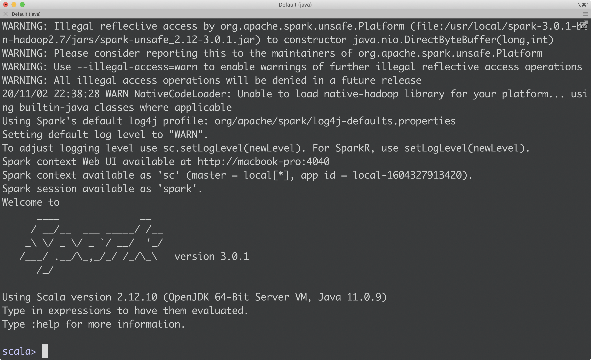
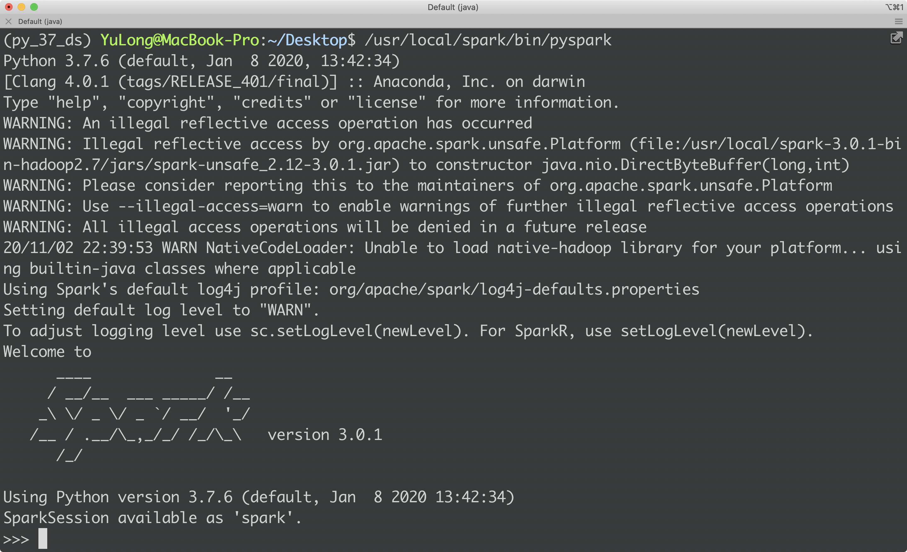

# Overview

1. wiki
2. official documentation
3. github

# Installation

1. [參考要裝什麼東西(java, scala, hadoop, spark)](https://medium.com/beeranddiapers/installing-apache-spark-on-mac-os-ce416007d79f)
2. [TODO verify hadoop to work!][參考相依版本 70+ stars on github](https://github.com/GalvanizeDataScience/spark-install)
3. [Ofiicial pre-build spark](https://spark.apache.org/downloads.html)

   1. xcode version `xcodebuild -version` (12.1), command-line developer tools, type `xcode-select -p`

   2. Java - `which Java` , `Java -version`

      * Java環境管理如下
      * 使用環境變數來控管目前Java版本 from [stackovetflow](https://stackoverflow.com/questions/46513639/how-to-downgrade-java-from-9-to-8-on-a-macos-eclipse-is-notz-running-with-java-9) - 例如java 8 : `export JAVA_HOME=$(/usr/libexec/java_home -v 1.8)`

``` 

(base) YuLong@MacBook-Pro:~$ /usr/libexec/java_home -V
Matching Java Virtual Machines (2):
    13.0.1, x86_64:	"Java SE 13.0.1"	/Library/Java/JavaVirtualMachines/jdk-13.0.1.jdk/Contents/Home
    1.8.0_232, x86_64:	"AdoptOpenJDK 8"	/Library/Java/JavaVirtualMachines/adoptopenjdk-8.jdk/Contents/Home

/Library/Java/JavaVirtualMachines/jdk-13.0.1.jdk/Contents/Home

```

   3. scala - `which scala` , `scala -version`

      * brew install scala@2.12 

  4. apache-spark (core written by scala, provide SQL, Java, Python API)

      * 從官網抓，homebrew版本會需要不同的dependency，[官網](https://spark.apache.org/downloads.html)
      * 裝在`/usr/local/spark-3.0.1-bin-hadoop2.7/`，soft link to `sudo ln -s /usr/local/spark-3.0.1-bin-hadoop2.7/ /usr/local/spark`
      * `which spark-shell`
      * `which pyspark`

  5. Hadoop - 從[hadoop官網](http://hadoop.apache.org/releases.html#Download)裝起來，裝2.7.3

      * `/usr/local/hadoop-2.7.3/`
      * soft link`sudo ln -s /usr/local/hadoop-2.7.3/ /usr/local/hadoop`

  

  6. SparkUI

  
  (py_37_ds) YuLong@MacBook-Pro:/usr/local/spark$ ./sbin/start-all.sh

# Hello world

</img>

</img>

# log & trouble shooting

## **java 11**

``` 

(base) YuLong@MacBook-Pro:~$ brew reinstall openjdk@11
==> Downloading https://homebrew.bintray.com/bottles/openjdk%4011-11.0.9.catalina.bottle.tar.gz
Already downloaded: /Users/YuLong/Library/Caches/Homebrew/downloads/db45763ecc0980d5c664bed53e7913898d4105736f7d07967bba385a52566ca7--openjdk@11-11.0.9.catalina.bottle.tar.gz
==> Reinstalling openjdk@11
==> Pouring openjdk@11-11.0.9.catalina.bottle.tar.gz
==> Caveats
For the system Java wrappers to find this JDK, symlink it with
  sudo ln -sfn /usr/local/opt/openjdk@11/libexec/openjdk.jdk /Library/Java/JavaVirtualMachines/openjdk-11.jdk

openjdk@11 is keg-only, which means it was not symlinked into /usr/local,
because this is an alternate version of another formula.

If you need to have openjdk@11 first in your PATH run:
  echo 'export PATH="/usr/local/opt/openjdk@11/bin:$PATH"' >> /Users/YuLong/.bash_profile

For compilers to find openjdk@11 you may need to set:
  export CPPFLAGS="-I/usr/local/opt/openjdk@11/include"

==> Summary
🍺  /usr/local/Cellar/openjdk@11/11.0.9: 653 files, 297.2MB

```

**xcode**

``` 

Issue

要更新xcode
==> Downloading https://downloads.lightbend.com/sc
Already downloaded: /Users/YuLong/Library/Caches/Homebrew/downloads/2967987adb240d4c63fa6c114488f12701eb8f45e9628b1a38347be7c3b5e510--scala-2.13.3.tgz
xcrun: error: invalid active developer path (/Library/Developer/CommandLineTools), missing xcrun at: /Library/Developer/CommandLineTools/usr/bin/xcrun
Error: Your Xcode does not support macOS 10.15.

解決 - 把xocde commandlione tools裝起來即可

==> Downloading https://downloads.lightbend.com/scala/2.13.3/scala-2.13.3.tgz
Already downloaded: /Users/YuLong/Library/Caches/Homebrew/downloads/2967987adb240d4c63fa6c114488f12701eb8f45e9628b1a38347be7c3b5e510--scala-2.13.3.tgz
==> Caveats
To use with IntelliJ, set the Scala home to:
  /usr/local/opt/scala/idea
==> Summary
🍺  /usr/local/Cellar/scala/2.13.3: 41 files, 22.8MB, built in 2 seconds

```

## `ERROR SparkContext: Error initializing SparkContext.`

1. intesting thing is 

using wejump3-5G/WEJUMP 2 (應該是因為防火牆問題)

``` 

21/01/11 15:44:02 ERROR SparkContext: Error initializing SparkContext.
org.apache.spark.SparkException: Invalid Spark URL: spark://HeartbeatReceiver@macbook-pro.wejump_nat:55259
```

using My ASUS

worked!

``` 

Python 3.7.6 (default, Jan  8 2020, 13:42:34)
[Clang 4.0.1 (tags/RELEASE_401/final)] :: Anaconda, Inc. on darwin
Type "help", "copyright", "credits" or "license" for more information.
21/01/11 15:45:36 WARN Utils: Your hostname, MacBook-Pro.local resolves to a loopback address: 127.0.0.1; using 192.168.52.57 instead (on interface en0)
21/01/11 15:45:36 WARN Utils: Set SPARK_LOCAL_IP if you need to bind to another address
WARNING: An illegal reflective access operation has occurred
WARNING: Illegal reflective access by org.apache.spark.unsafe.Platform (file:/usr/local/spark-3.0.1-bin-hadoop2.7/jars/spark-unsafe_2.12-3.0.1.jar) to constructor java.nio.DirectByteBuffer(long,int)
WARNING: Please consider reporting this to the maintainers of org.apache.spark.unsafe.Platform
WARNING: Use --illegal-access=warn to enable warnings of further illegal reflective access operations
WARNING: All illegal access operations will be denied in a future release
21/01/11 15:45:36 WARN NativeCodeLoader: Unable to load native-hadoop library for your platform... using builtin-java classes where applicable
Using Spark's default log4j profile: org/apache/spark/log4j-defaults.properties
Setting default log level to "WARN".
To adjust logging level use sc.setLogLevel(newLevel). For SparkR, use setLogLevel(newLevel).
Welcome to
      ____              __
     / __/__  ___ _____/ /__
    _\ \/ _ \/ _ `/ __/  '_/
   /__ / .__/\_,_/_/ /_/\_\   version 3.0.1
      /_/

Using Python version 3.7.6 (default, Jan  8 2020 13:42:34)
SparkSession available as 'spark'.
>>>
```

# Summary

| language/pkg | version | note |
|--------------|---------|------|
| pyspark      | py4j=0.10.9 |      |
| spark        | 3.0.1   |      |
| hadoop       | 2.7     |      |
| java         | 11      |      |
| scala        | 2.12    |      |

# spark-on-hadoop

為了上 spark 可以直接在 hadoop file system 上操作，以及使用 gcs (底層也是 hadoop file system)

1. 撰寫設定檔

`vi spark-3.1.2-bin-hadoop2.7/conf/spark-default.conf`

```
   # https://stackoverflow.com/questions/55595263/how-to-fix-no-filesystem-for-scheme-gs-in-pyspark
  spark.hadoop.google.cloud.auth.service.account.enable true # 讓pyspark啟用google.cloud.service
  spark.hadoop.google.cloud.auth.service.account.json.keyfile path_of_you_key # 給 spark 你的 gcp key
  spark.hadoop.fs.gs.impl com.google.cloud.hadoop.fs.gcs.GoogleHadoopFileSystem # 啟用gcs的java實作
  spark.hadoop.fs.AbstractFileSystem.gs.impl com.google.cloud.hadoop.fs.gcs.GoogleHadoopFileSystem # 啟用 gcs 的 java 實作
  spark.hadoop.fs.gs.project.id your_project_id # 給定gcp project id

```

2. 下載 spark 連接 gcs 的 hadoop 實作(.jar)

`gcs-connector-hadoop2-2.0.1.jar`(for hadoop 2) 放到

`spark-3.1.2-bin-hadoop2.7/jars`

3. 完成