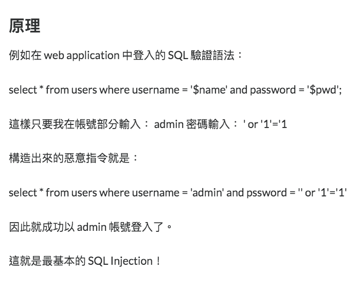

# Intro
[SQL injection 介紹 加上多個injection pattern](https://ithelp.ithome.com.tw/articles/10158844)

</img>

# How to avoid
* [check this answer](https://stackoverflow.com/questions/48870227/is-sql-injection-protection-built-into-sqlalchemys-orm-or-core)
  * avoid using raw sql
  * never combine the data string with the query string, use sqlalchemy ORM model objects to describe your query
* [Python pandas.read_sql SQL injection safe?](https://www.reddit.com/r/Python/comments/8glw9h/python_pandasread_sql_sql_injection_safe/)
  * use parameters in `pd.read_sql`, it will use sqlalchemy to deal with the query construction