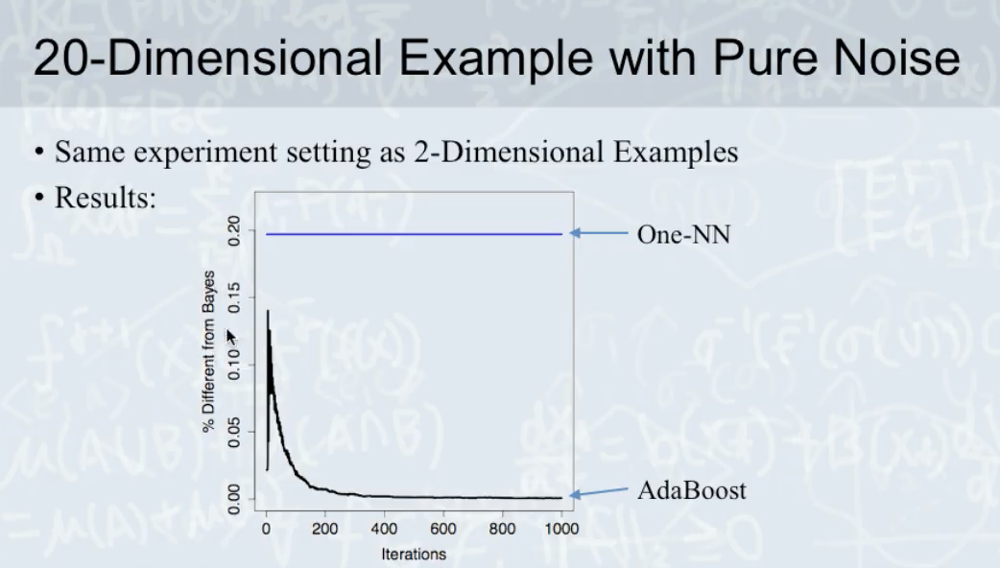

# Explaining the Success of AdaBoost and Random Forests as Interpolating Classifiers

[Explaining the success of adaboost and random forests as interpolating classifiers](https://scholar.google.com/scholar_url?url=https://www.jmlr.org/papers/volume18/15-240/15-240.pdf&hl=zh-TW&sa=T&oi=gsb-gga&ct=res&cd=0&d=10497145485605770183&ei=7xIQYJrcJ47gygSqhZzICw&scisig=AAGBfm0lLTCzaym74UVIgSmEcrSXeaMcwA)

Basically Case Study, no new mathmatical analytics.

</img>

Interpolating Model is a inifinity model complexity!

# Model Summary

## AdaBoost

base classifier $G_1$ which is a simple classifier(model complexity is low, $a_{1}$ is the weights of $G_1$)

</img>

Then we enlarge the smaple $G_1$ mistook.

</img>

concat all of the $N$ Classifier

</img>

Basically a Relay race of weak classifier.

So the Algorithm of AdaBoost

</img>

Consider the $err_{m} \rightarrow 0$, $a_{m} \rightarrow \inf$ (all classifier will listen to him!) 

## Random Forest

</img>

1. boostraping
2. feature - subsampling
3. Decision Tree

</img>

the Random Forest algorithm can be highly parallelize.

# Learning Theorem

</img>

VC Bound is a mathematical analytics to claim there is an upper bound so that 

$$\epsilon(h) \leq \hat{\epsilon}(h) + VC Bound$$

But VC bound is a loose bound, in real-world, many senario may not fit VC Bound.

The VC Bound is a function of :

1. number of data :  $n$
2. model complexity(feature dimension) : $d$
3. $\delta$ :  a probability which you need to check the your machine learning foundation note.

## VC Dimension of Adaboost

$m$ :  number of weak classifier

$g$ : hypothesis space

$G_m$ : weak classifier hypothesis.

</img>

</img>

Replace $d$ with $M$

Does number of weak classifier $M$ really make your model overfit?

In practice...

</img>

Actually, there is a good fit, your result still fit the VCBound.

## Local Robustness of Interpolating Classifiers.(The paper Claim)

</img>

When $M \rightarrow \inf$, the model complexity of Adaboost goes to $\inf$

</img>

When noise in your data. The more complexity model is more local robustness!

Consider the dark blue line, if the seperation is $\inf$, which $M \rightarrow \inf$

</img>

The dark blue line also called spike smooth(spike with noise, smooth with the other)

## Experiments

### Two-Dimensional Example with Pure Noise

</img>

</img>

Limit complexity get worst result!

</img>

One-NN is knn, k == 1.

</img>

## Self-Average Property 

How your model achieve locally robustness?

Case study!

</img>

If you are doing some ensemble, you can achieve the spike smooth(locally robustness)

The dropout is a ensemble technique, also make your nn achieve spike smooth(locally robustness)

</img>

</img>

## Real Data Example

</img>

</img>

No overfitting, But how to ensure there is a locally robustness property?

</img>

Design an experiments, flip a data point.

mesure the neighbor change vs training epoch(each $M$ classifier)

# Next topic

# Misc and QA

1. Math eq is still important, because case stduy is still too individual. We always need a generlized analytics.
2. JMLR(Journal of Machine Learning Research)
3. Conference / Journal are different. The good theoratical paper always send their idea to joural.

# Papers

1. Neural Tangent Kernel : Convergence and Generalization in Neural Networks

2. [Overfitting or perfect fitting? Risk bounds for classification and regression rules that interpolate NIPS 2018](https://papers.nips.cc/paper/2018/file/e22312179bf43e61576081a2f250f845-Paper.pdf)
