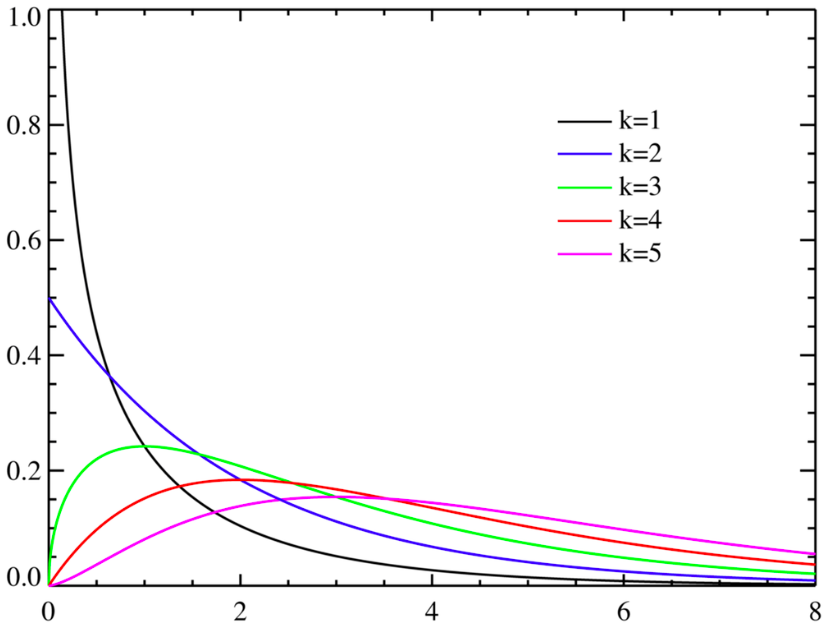
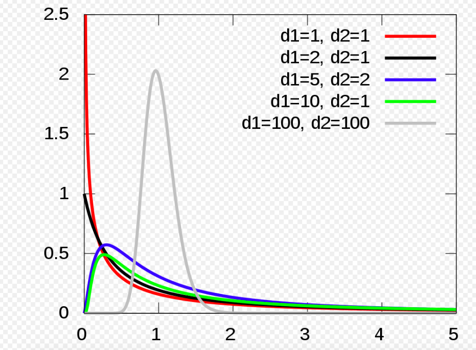

# t distribution
# chi distribution
從一個服從常態分配的母體中，即$N(X:\mu, \sigma)$，每次抽取$n$個樣本，$X_1, X_2, ...X_n$，該組樣本可以計算一個卡方統計量(chi square)
$$
\chi^{2} = \sum_{i=1}^{n}(\frac{X_{i}- \mu}{\sigma})^{2} = \sum_{i=1}^{n}Z_{i}^{2}
$$
將以上的抽樣過以及Z轉換進行無限多次，可以得到無限多個$\chi^{2}$，這些$\chi^{2}$形成的distribution則稱為$\chi^{2}$ distribution。

更延伸來說，我們可以將抽樣數量$n$也當作參數之一，即

$$
\chi^{2}(n) = \sum_{i=1}^{n}(\frac{X_{i}- \mu}{\sigma})^{2} = \sum_{i=1}^{n}Z_{i}^{2}
$$

下圖中的$k$就是上式中的$n$
</img>

應用case
物理意義/統計意義

# f distribution
該分佈以Ronald Fisher先生的名字命名，他發明了F分佈來決定ANOVA中的關鍵值

如果想要調查以下兩個組別是否具有同樣的方差，我們就必須計算兩組標準差的比值

$$
F = \frac{S_{x}^{2}}{S_{y}^{2}}
$$

其中$S_{x}^{2}$是第一組樣本的樣本標準差，$S_{y}^{2}$是第二組樣本的樣本標準差，這個統計量就是F score

</img>

在ANOVA中的應用來說，F分佈的臨界值應過3個變量計算出來

1. ANOVA 分子的自由度
2. ANOVA 分母的自由度
3. 顯著性水平 

在ANOVA的推導中，最後恰好需要計算兩樣本的F score

$$
F(d1, d2) = \frac{\chi^{2}_{d1}}{\chi^{2}_{d2}}
$$

