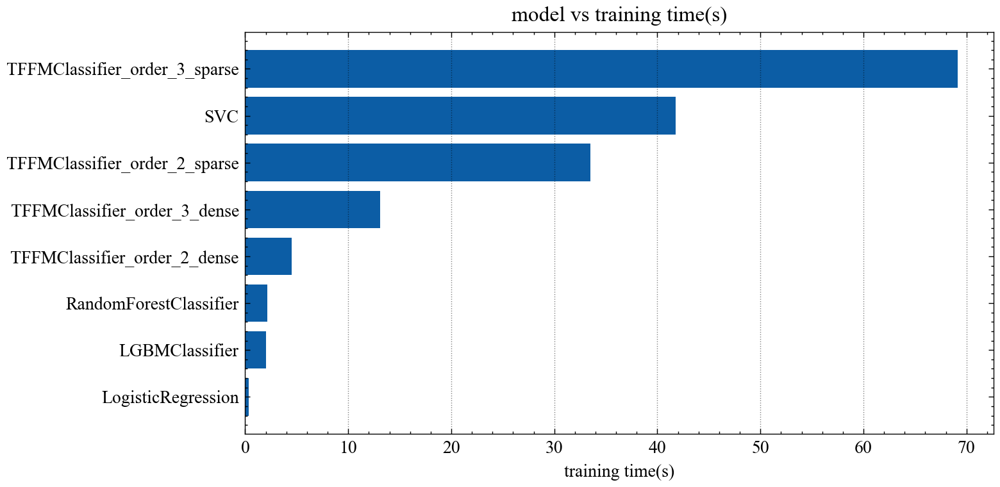

# Factorization Machine II

本篇分析重點會在原始碼

[tffm](https://github.com/geffy/tffm)

[tensor-fm](https://github.com/gmodena/tensor-fm)

tffm主要是透過tensorflow1.8來開發(筆者用tensorflow 1.14跑，小改了幾個變數名稱就能動了)實作的是任意Order都可用的

[High Order Factorization Machine(HOFM)](https://arxiv.org/pdf/1607.07195.pdf)

tensor-fm主要則是透過tensorflow2.0以及sklearn實作了factorization machine並使用sklearn的wrapper包起來

## FM Order = 2

FM Order = 2 的部分分析的是[tensor-fm](https://github.com/gmodena/tensor-fm)這組程式碼

看起來還算挺直白的，幾乎就是方程式直接翻譯過來

</img>

怎麼訓練呢?

</img>
</img>

該程式碼還用sklearn包了一層，讓使用起來的感覺就sklearn一樣，但實作的時候並沒有實作sparse matrix，也就是就算只要幾個index有值，for loop還是會全部跑一遍

## FM Order >= 2

### source code小改的部分

clone下來有看到 `test.py` 當然就是趕快跑一波，確保功能都可以用

1. 由於我使用的是tensorflow 1.14，所以Adam要換成AdamOptimizer
2. sklearn版本可能也不同，我的是0.22.0，因此把`from sklearn.datasets import fetch_mldata` 改成了

 `from sklearn.datasets import fetch_openml`

3. 基於實驗用途，我直接clone並沒有pip安裝，因此把package加入了path path

### 原始碼架構

原始碼分析工具的選用上，除了IDE可以快速跳轉到要看的地方，透過視覺化介面也有助於快速掌握整體架構，這裡筆者使用sourcetrail這套分析工具來分析程式碼

</img>

原始碼架構上有4個類別，從圖來看繼承關係是

TFFMCore ->  TFFMBaseModel -> TFFMClassfier / TFFMRegressor

## FMClassifier / FMRegressor

</img>
</img>

FMClassifier / FMRegressor 處在最高階的封裝，

FMRegressor僅提供了fit, predict，而loss function只支援了mse

FMClassifier除了支援fit, predict之外，也支援了predict_prob以及sample weight上的調整，loss function則是logistic loss

</img>

### FMBaseModel

FMBaseModel處在第2階段封裝，定義了較多只要是個模型大致上都需要的功能，像是

是個模型可能都需要的 : batch_size, n_epochs, sample_weight, verbose

模型狀態儲存及tensorflow session生命週期管理 : save_state, load_state, session, session_config, destroy

模型監控相關的(tensorboard-related) : summary_writer, need_logs, log_dir

並且希望只要是個model，就一定要有predict方法，intercept以及weights設計成唯讀的形式

</img>

主要訓練過程也在這個類別被定義

</img>

### FMCore

</img>
FMCore處在第一階封裝，定義了計算圖的初始化，怎麼跑計算圖，計算圖的長相等，也定義了演算法實作細節

演算法實作細節 : 

input_type : (dense or sparse)

order : 特徵交叉項要做到幾階(對，這份實作支援任意階數的特徵交叉)

rank : latent factor的數量

至於其他比較常見的內容像是 : n_features, optimizer, loss_function, reduce_loss, loss

其他用tensorflow.name_scope包起來的方法和變量 : init_placeholders, init_main_block, init_regularization, init_target, ...

右排的wrapper則是針對desne data 以及 sparse data做了不一樣的計算方式，sparse data並不需要整個矩陣都存下來，並且可以只針對index做運算，其他的都是0所以可以不用算

只要存shape以及有值的index，該數值是什麼，可以看到有count_nonzero, matmul, pow等方法

最重要的計算圖在 `main_block` 當中

</img>

上面計算圖是High-Order的計算圖，可以看到對於order以及power特進行了處理

因此以下實驗我們我們選用tffm來進行分析

## 準確度/訓練時間/推論時間分析

和幾個常見的模型比較，訓練時間，準確度，以及推論時間為何?

資料集 : MNIST, 數字3以及數字5

| 資料列數 | 特徵數 | 非零特徵比例 |
|--------|-------|------------|
| 10625  | 784   | 4%         |

訓練集 : 測試集 = 7:3

目標佔比 = 46 : 53

| 比較模型             |
|---------------------|
| LR                  |
| RF                  |
| SVM - order 2       |
| LGBM                |
| FM - order 2 dense  |
| FM - order 2 sparse |
| FM - order 3 dense  |
| FM - order 3 sparse |

</img>

</img>

</img>

</img>

1. 準確度可以看到FM order = 3的準確度更高，接下來則是LGBM
2. SVM order = 2在這個資料集是訓練的起來的(但需要訓練很久)，應該是在特定的情況下SVM order = 2會訓練不起來
3. tffm的sparse input實作上可能有一些問題，在我的mac上跑訓練和推論都是dense比較快，這與理論上不太符合，sparse input應該要可以比dense input來得快才是
4. FM order = 2 及 FM order = 3 如實能夠做到自動化特徵工程以及還不錯的訓練速度/推論速度
5. LR 可以有最快的訓練速度以及推論速度，單個樣本的推論速度在我的mac上可以跑到0.06毫秒
6. 若是需要準確度和訓練速度/推論速度上的權衡，LGBM也可以加入作為實驗對象，LGBM表現也不錯，且推論時間也不慢(但MNIST資料集應該是難度相對簡單)
7. 用tensorflow寫的好處是可以透過GPU在加速訓練及推論，相關benchmark可以在[這裡](https://github.com/geffy/tffm/blob/master/gpu_benchmark.ipynb)找到

## 特徵數量 - 時間複雜度分析

FM - order = 2

latent factors = 100

inference time samples  50

errbar : std

</img>

1. dense input的推論相對穩定，sparse input則不太穩定，從dense input的資料來看，時間複雜度是線性的，而900個Feature大致上是0.9毫秒的推論時間

<!-- ## Notebook

[model_training_inference_acc](demo/fm/model_training_inference_acc.ipynb)

[model_tuning](demo/fm/model_tuning.ipynb) -->
