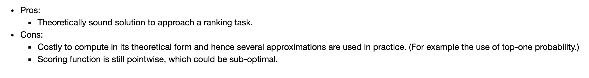

# Ref

metrics : 

1. [AUC](https://www.zhihu.com/question/39840928)

methods:

1. [wiki](https://en.wikipedia.org/wiki/Learning_to_rank)

2. [机器学习算法-初识Learning to Rank](https://jiayi797.github.io/2017/08/30/%E6%9C%BA%E5%99%A8%E5%AD%A6%E4%B9%A0%E7%AE%97%E6%B3%95-%E5%88%9D%E8%AF%86Learning-to-Rank/)

3. [learning to rank](https://everdark.github.io/k9/notebooks/ml/learning_to_rank/learning_to_rank.html)

# What is Learing to Rank(LTR)?

ML tech to solve a ranking task, usually it is a superbised task and sometimes semi-supervised.

Regression : 

1. features $x$
2. function $f(x)$
3. target $y \in \R$

Classification

1. features $x$
2. function $f(x)$
3. target $y \in \{1, 2, ...N\}$ with N-classes

Learning to Rank

1. query $q$, list of items $D$
2. function $f(q, D)$
3. target - ordering

## Web Search Ranking

1. query $q$, $n$ doc $D = d_{1}, d_{2}, ..., d_{n}$
2. function $f(q, D)$
3. target - ordered list of documents $D^{*}$

datasets : 

1. Microsoft LTR dataset
2. Yahoo LTR Dataset

## Other form

1. Recommendation system(personal product perference ranking)
2. Stock portfolio selection(quity return ranking)
3. Message auto reply(best-candidate ranking in email/message reply recommendation)
4. Image to text(best-candidate contextual feature)

## Types

* Pointwise
* Pairwise
* Listwise

distinguished by how we formulate the **loss function** in the underlying ML task.

## Pointwise

ranking --> regression by

* $f(q, D)$ --> $f(q, d_{i})$ relevance of each document given a query is scored independetly

Construct training dataset 

</img>

</img>

## Pairwise

as binary classification 

</img>

</img>

$s_{i}$ : the score $f(q, d_{i})$

e.g. 

$f(q, d_{1}) = 3$

$f(q, d_{2}) = 1$

$Pr(i > j) = \frac{1}{1 + exp^{-{(3-2)}}}～ \frac{1}{1+0.37}$

**NOTE : why?? kind of regularization?**

</img>

* sometimes we don't have the pointwise score, but we have the pairwise preferences.

* dosn't consider position in the list(1 < 2 is more important than 10 < 11)

## Listwise

Core concept : permutation probability

$\pi$ as particular permutation of a given list of lnegth $n$

given query $q$, document $i$, as scoring $s_{i}$ - $f(q, d_{i})$ = $\phi(s_{i})$

$Pr(\pi) = \Pi_{i=1}^{n} \frac{\phi(s_{i})}{\sum_{k=1}^{n}\pi_{s_{k}}}$

</img>

</img>

</img>

* The whole list should be a exponential decay from 1 ~ N by each query and document set.

# Evaluation

Binary Relevance 

* MAP
* MRR

Graded Relevance

* NDCG
* ERR(Expected Recuprocal Rank)

# Live Demo

https://everdark.github.io/k9/notebooks/ml/learning_to_rank/learning_to_rank.html

* Yahoo LTR Dataset
* lightgbm with `LambdaMART`(Ranking Metrics optimization as loss function)
* tensorflow - Listwise LTR