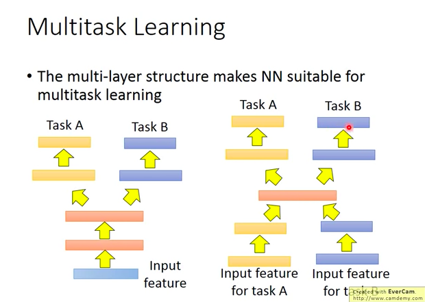
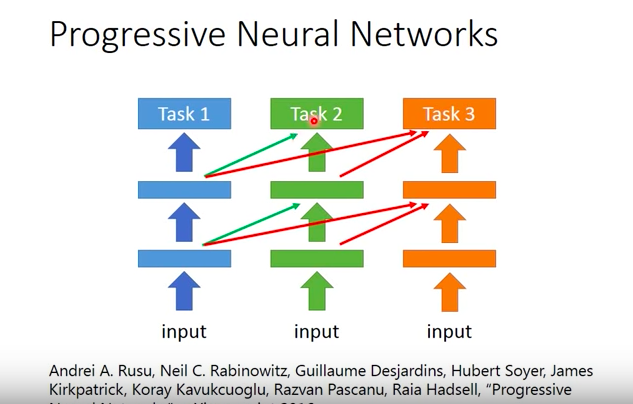

# Transfer_learning
[李宏毅 ML 19 Transfer Learning](https://www.youtube.com/watch?v=qD6iD4TFsdQ&list=PLJV_el3uVTsPy9oCRY30oBPNLCo89yu49&index=28)

</img>

* 和現在要進行的task沒有直接相關的data
  * E.g. 手上有貓跟狗的data，有分辨cat, dog的model，但是你有另一組data是大象跟老虎，而你想要做一個classfier - input domain相似，但是task不同 **similar domain, different tasks**
  * E.g 手上有貓跟狗的data，有分辨cat, dog的model，但你有另一組data是高飛狗和招財貓，而你想要做一個classifer - input domain不同，但是task相同 **different domain, similar tasks**

* 我們能不能夠在現在有一些不相干data的情況下，來幫助我做現在的task?
  

舉幾個例子 : 
1. 語音辨識 - 台語，但是根本沒啥台語的data，你去youtube收集一堆中文跟英文的，transfer learning企圖用其他語言的辨識來improve 台語的語音辨識!
2. 影像辨識 - 醫學影像辨識，但是醫學影像很少，不過你可以在網路上爬到一大堆有的沒的的圖片!
3. 文件分析 - 法律文件分析，資料很少，但是有沒有其他網路文件有幫助??
4. 結構化資料 - 嫁接學習?
</img>

## Transfer Learning有可能嗎?
* 其實是合理的，例如你不知道研究生要怎樣過生活，你就搜尋漫畫家，他的主角就是研究生
* 或是你不知道怎麼打排球，你就搜尋排球少年，排球少年教你怎麼打排球

</img>

## Transfer Learning - Overview
* 有很多的方法，事實上Transfer Learning是很多很多方法的集合
* 有些名詞有人說是有人說不是，李教授覺得概念是，其實就是，所以整理再一起

</img>

* 暫且分成兩個部分，Target data以及Source Data

* Target Data指的是真正想要進行的任務
* Source Data則是我們手上現在有的，不那麼相關的Data
  * 注意，怎麼定義跟當前任務沒有直接的關係，這是一個比較模糊的地帶，目前有多個門派的說法
  * A門派 : 真實物體的image以及動畫版本的images，沒有直接關係
* 接著兩種Data簡單區分一下為有label以及沒有label，接著就產生4種可能

### labelled, labelled

</img>

</img>
 
#### Model Fine-tuning
看下圖，通常Target data非常少，而Source data有一大把，就像知乎中的嫁接學習

* 然而如果Target data非常之少，則稱之為One-shot Learning(一種特化出來，特別針對imblance ratio超大的情況所做的調整)
* 舉例 : 特定人員的語音辨識的特定語句辨識，Target data少，Source data多(其他不同人的背景)
* 直接用source data training，然後在target data上tuning model(like adversirial validation)，其實就想成source data traning出來的是initial value，然後在target data在train一發，然後就結束了，但是要很小心Overfitting，或許regularization要強一點，接下來就是介紹一下怎麼做到這件事
  
#### Conservative Training

</img>
* Regularization的方式可以選擇像是
  * output 的prediction在同樣的sample data不要差太多
  * model中的weight的L2 distance不要差太多
  * 或是其他你想得到的方法

#### Layer Transfer
</img>
* 同樣架一個新的Model，把某幾個layer直接copy到新的model裡面
* Target data只training新的layer
* 例如只有一層新的layer拿來train target data，如此一來只要考慮很少的參數，避免Overfitting
* Data夠多時，可以直接fine tune整個model
* `Layer Transfer`其實是個非常非常常見的小技巧
* 但是，哪些Layer應該要被transfer? - 不同任務有不同特性
</img>

* Speech : Copy最後幾層，重新train inputs 那層
  * why ? heuristic : 每個人講話，用同樣的發音方式，但是因為口腔結構，或是習慣不同，得到不同的頻譜，而NN是從聲音訊號來得知語者的發音方式，顯然input layer會和發音方式有關係
* Image : 通常Copy前面幾層，只train最後幾層
  * 如果把layer的weight畫出來，會發現說，前面幾層通常是學到一些直線橫線，簡單幾何圖形，越往後走越偏向高階特徵

</img>

* 所以就有人來做實驗了，NIPS, 2014 How transferable are features in deep neural networks? - citation : 3630
* ImageNet 有1000個class，其中500個當作Source，另外500個當作Target
* x軸是transfer learning時copy幾個layer，copy 0個layer就是沒有做tansfer learning，直接train，作為baseline，縱軸是Top1 accuracy
* n = 1，copy第一個layer，後面的layer全部re-train，...
* 如果copy太多layer，結果是會變差的，如果只copy了前面兩三個，結果是換變好的，各種顏色還要從原始論文了解一下定義
* 而這張圖解釋了，不同task上的Model，前面幾個layer是可以共用的，後面則不行
* 橙色線表示換過layer，而且做parameter optimization
* 但是需要注意，這個task的target data非常多
* 藍色線(fragile co-adaption 脆弱的layer互適應性)，是這篇論文的另一個發現，主要是想表示說，layer之間是要互相搭配的，沒辦法只train部分，這樣後面的layer和前面的layer無法互相搭配
  * fragile 脆弱的 adj

</img>
* 第二項實驗，如果Source Data和Target Data的distribution差較多，那會怎樣? - follow 人們的直覺
* x軸和y軸仍然是一樣的
* 如果Target data 和 source data差較多，例如人造物品以及自然物品，那麼transfer learning的效果就會差很多
* 而從x軸可以看出，就算Source Data和Target Data差很多，前面的layer仍然是可以copy的，performance差得較少
* 爛掉那條橘色線，則是將NN的weight取亂數，看會發生什麼事

### labelled, labelled, Multi-task

</img>

Multi-task和model fine tuning的差別是
model fine tuning : 只care在target domain，model能不能做得好 - source domain爛掉就算了
multi-task : 在乎source domain以及target domain能不能做好

* 其實Deep Learning Based的方法特別適合拿來做Multitask Learning

* 下面同時展示兩種方式
</img>

* 左圖 : 確定input data含有兩個task所需要的feature，所以前面幾層就直接共用 - face detection and face alignment

* 右圖，確認中間層能夠萃取出有用的抽象特徵，所以共用

* 一個成功的例子，多語言的語音辨識 

</img>

* 目前發現就算是很不同的語系，NN還是能夠做transfer learning

#### Transfer Learning 是否有負面效應?
* 是有可能的，如果兩個Target Domain不像的話，就會有負面的效應
* 但是如果每次都要思考能不能transfer，很浪費時間，所以有人發明了進步神經網路(Progressive Neural Networks, 2016)

</img>

* 主要思想是這樣的，借用Task1的所有layer，讓Task2都用新的一層weight來接Task1的layer，所以Task1的Performance不會變差，作者本人也覺得這樣怪怪的，因為層數會很多

### labelled, unlabelled, Domain-adversarial training

</img>

</img>
* TARGET MNIST 加上奇怪的背景
* 通常來說，我們就會把Source data視為Training data，Tatget data視為 Testing data
* 而training data和testing data 分佈mismatch(基本上就是Kaggle上遇到的testing data資料分佈不一樣的情形...)

### Domain-adversarial training
* NN前面可以視為feature extractor, 後面可以視為classifier
* 把feature拿來看會發現什麼事? - 怎麼看? T-SNE
* 如果把source data標成一類，target data標成一類，把embedding layer拿去做T-SNE，會看到以下情形，source data和target data是全然不同的分佈，而且source data有10類也被看起來可以被區分XD

</img>

* 所以classifier雖然可以把藍色的部分做好，但是紅色部分的testing data基本上就是無能為力

`想要做到的事情是，feature extractor可以把source data的domain去除掉`
adversarial基本上是從GAN來的，原理很像
視覺來上說，希望embedding space做T-SNE之後，source和target是不可被區分的，就可以說，feature extractor學到的是更general的特徵，可以同時滿足source data和target data

* 這裡的feature extractor舊稱作為generator
* discriminator在這個例子則是一個Domain classifier，該Domain classifier要預測式source data還是target data

</img>

* 但是會有trivial solution，Domain classifier直接全部預測source data，結束，所以要增加訓練難度，怎麼增加?
* 同時做label predictor以及騙過domain classifer
* 三個加在一起，其實就只是一個 Multi-task (2 task actually)的NN
* 三項網路各有不同的任務

</img>

* 怎麼做到這件事呢?
* 其實就是在domain classfier加入reversal layer，給gradient 負的貢獻
* back-propergation時有forward以及backward兩個process
* backward時回傳負的
* 基本上feature extractor一定會fail掉，但是希望他奮力掙扎
* 基本上應該是一個很難training的model

#### 一些結果
TBD 45:42
## Reference
[How transferable are features in deep neural
networks? NIPS 2014 citation 3630次](http://papers.nips.cc/paper/5347-how-transferable-are-features-in-deep-neural-networks.pdf)
[Domain-Adversarial Training of Neural Networks 2015, citation 1484](https://arxiv.org/abs/1505.07818)
[Domain-Adversarial Neural Network in Tensorflow github,495 star](https://github.com/pumpikano/tf-dann)

[Domain-Adversarial Neural Network in PyTorch github, star 261](https://github.com/fungtion/DANN)