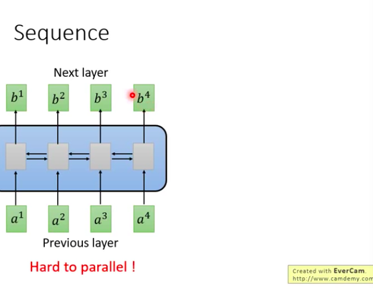
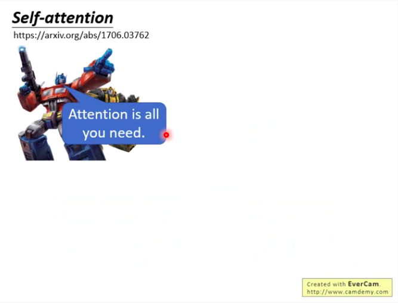
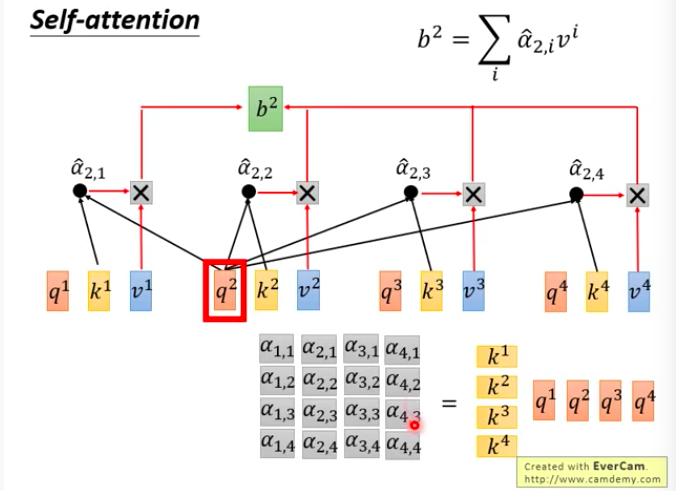
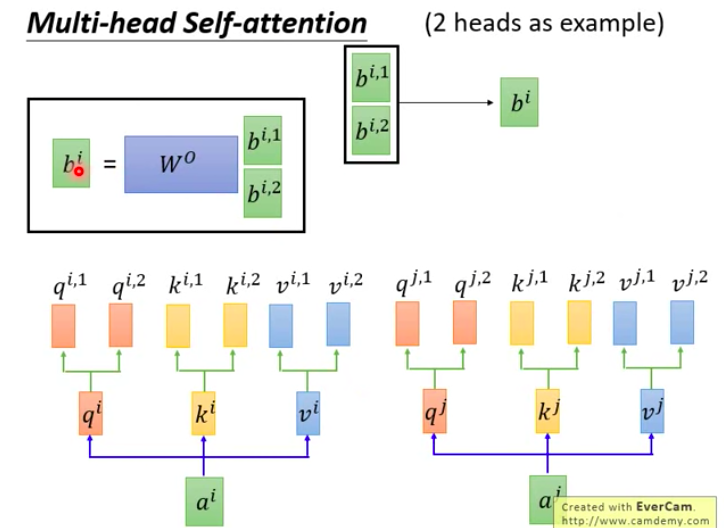
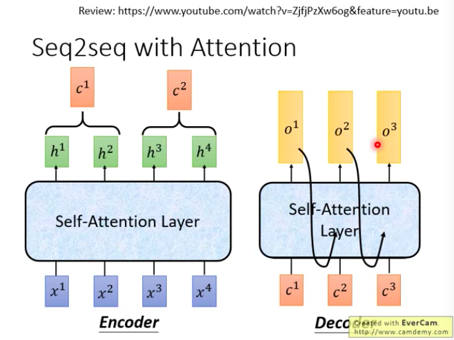
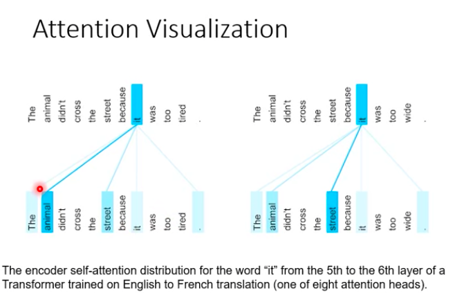

# Resource

* [tranformer by Hung-yi Lee, 2019](https://www.youtube.com/watch?v=XnyM3-xtxHs&list=PLJV_el3uVTsOK_ZK5L0Iv_EQoL1JefRL4)
* Summary : RNN的缺點是不可平行化，因此改裝CNN，讓他達到RNN的效果，並且使用一個可視覺化解釋的設計，這就是Attension layer，Attension layer的出現狂洗了以往所有RNN的方法，由於可以平行化，原本因為會算太久的事情現在都做得到了!

# Introduction

* 英文意思就是變形金剛
* 現在最有名的應用就是BERT - Unsupervised Pre-Trained Transformer

</img>
</img>

* 在Seq2seq大量使用self-attention
* 先備知識 Seq2seq, self-attension

</img>
</img>

* RNN有什麼問題 - 不容易被平行化，要看一個$b^{4}$，$a^{1}$到$a^{4}$都要看過才行
* 有人提議我們用CNN來處理這種情況
* CNN使用filter掃過一遍，我們也可以做到輸入一個seq，output一個seq，而cnn的filter可以平行處理，然而cnn只能考慮有限的上下文窗口，怎麼解決這個問題?
* 只要夠多層cnn，就能夠更大的感受野，如下圖，在$b^{1}, b^{2}, b^{3}$的filter基本上就是看過$a^{1}, a^{2}, a^{3}, a^{4}$的seq

``` 

cnn的優點 : 可以平行化
cnn的缺點 : 要做到跟rnn一樣的事，層數要比較多

```

</img>

# Self-attention

這個設計，可以只要一層，就可以把seq全部看過，而且，可以平行化，2017年出，只要可以用RNN做得現在全部都可以用self attention做，狂洗一輪paper

* 創始paper

</img>

``` 

q : query
k : key
v : value
```

</img>

``` 

psudocode

1. sequence x 先通過任意的網路結構，產生embedding a，這裡先假設是一個線性個Matrix，W
2. attention layer會對seq中的每個單元a做三個transform(透過neroun weight) : q, k, v，

這個q稱作query，待會會拿去和其他人match

k稱作key，會被其他人match

v則是information，會被抽取出來
```

* attention 吃兩個向量 - output一個分數
* 有幾百種做法，inner product廣義上來說就是一種attension
* self attention使用的是 scaled dot product attention - 為了讓分數之間能夠被比較，必須做normalization，這裡採用$d$ = dimension of q and k(因為q和k兩個向量的dimension越大，內積出來的variance就會越大)
* 老師提到你也可以做其他的attention方法，看看會怎樣，老師自己也沒做過實驗XD

</img>
</img>
</img>

* 接下來$q^{1}$對很多$k$做attention之後，把這些alpha值經過一層soft-max的layer
* 事實上soft-max也是一種normalization，normalized之後所有score加起來會是1，而這些$\alpha_{1, i}$的值最大的會佔最大比重，其他的都會小得多(exponential decay)

</img>

* 所以看起來這些$\hat{\alpha_{1, j}}$是把query和value match之後所產生的某種權重，接下來怎麼做呢，我們拿去和$v$相乘
* 你可以看到$b^{1}$事實上也是看過所有$a^{1}~-~ a^{4}$，然而你只想考慮local information而不是global information，只要$\hat{\sum_{j}\alpha_{1, j}v^{j}}$裡面的$\hat{\alpha_{1, j}}$足夠小，那麼那個input就沒有被收到更多的關注
* 至於到底要看到多遠，可以用attension layer根據資料去學習出來
* 這樣的做法是可平行化的，$b^{2}$不用等$b^{1}$就可以算出來

</img>
</img>

``` 

self attention做的事情和rnn是一模一樣的
但是可以平行的被計算出來
```

接下來我們用矩陣來描述一次，我們有提到$q^{1} = W^{q}a^{1}$, $q^{2} = W^{q}a^{2}$, 依此類推，我們可以把vector $a^{i}$拼起來

</img>
$$
Q = W^{q}I
$$

</img>
$$
K = W^{k}I
$$
</img>

$$
V = W^{v}I
$$

$\alpha$的計算也是可以平行的

</img>
</img>
</img>

$$
A = K^{T}Q
$$

$$
\hat{A} = sotmax(A) ~~\text{by column}
$$

計算$b$?

</img>

</img>

$$
O = V\hat{A}
$$

我們再從top level看一次

</img>
</img>

你會發現全部都是矩陣乘法，拿去GPU裡面加速吧!

# Multi-head Self-attention

* 一種變形
* $q, k, v$分裂成兩個，最後再接起來
* 有可能不同的head會關注不同的$\alpha$，可能一個關注短期，一個關注長期等，你想做幾個head都可以
* Multi-head的好處是在現行架構下，每一個attention幾乎就只會關注到一個值，如果你希望他關注到多個值，你就可以使用Multi-head的self attention

</img>

但是一個head只對一組q, k, v 作用
兩個head產生$b^{1, 1}, b^{i, 2}$然後再乘上一個$W^{0}$變成$b^{i}$

但是我們仍然會想要同樣的output，所以最後這些$b$還會降維回來
</img>

* 但實際上我們只要一個$b$，所以這些multi-head的result還可以再透過一個matrix降維回來1維的$b$
* 透過這樣的機制就可以關注多個位置的information

</img>

# Positional Encoding

* 如果你仔細看，你會發現在self attention中，seq的順序是不重要的，都會產生一樣的值
* 原始的Paper，還必須將上一個$e^{1}$, $e^{i}$是hand crafted，代表了位置的資訊

</img>

* 為什麼是相加而不是concat?
* 李老師這邊提供了一個直觀的觀點，對於原本的X我們都給訂一個p，採用one-hot的編碼來表達位置資訊，是一個column vector，concat，然後在乘上$W$，於是乎就會發現需要一個$W^{I}, W^{P}$

</img>

</img>

* 然而在$W^{p}$的學習上，原始paper(attention is all you need)中，google團隊有做過嘗試，然而並沒有比較好
* 所以我們可以看到說，$a^{i}$就是$W^{I}x^{i}$，$e^{i}$就是$W^{P}p^{i}$

  
</img>

# Seq2seq with Attention

* 一般的seq2seq的架構會有一個encoder以及decoder

</img>

Encoder -> 雙向RNN, decoder -> RNN 全部換成Self-Attention

</img>

* google的動畫 - 36:32

</img>

</img>

* 架構解說 - 39:00

</img>

* Batch norm - 對一個batch裡面的不同data的同一個dimension做normalization，希望不同data的feature影響力不要差太多
* Layer norm - 對於一筆data，各個不同feature dimension的影響力不要差太多，一般RNN會搭配Layer normalization

</img>
</img>

</img>

* Input 機器學習
* Decoder input BOS(Begin of Sentence)，output machine
* 再輸入machine 輸出learning
* 再輸入learning，輸出句點 結束
* 所以有一個Masked Multi-Head Attention是因為在產生output sequence的時候，尚未產生的token沒辦法被attention，所以Mask Multi-Head Attention已經有的output word做Attention
* 接著再拿Encoder裡面已經看過的input做attention

# Attention Visialization

每兩個word會有一個attention

* 左方，The animal didn't cross the street because it was too tired.
  + it 對應到animal最明顯
* 右方，The animal didn't cross the street because it was too wide. 
  + it 對應到street最明顯!

訓練完attention NN 把attention layer拿出來分析 =)

</img>

顯然Multi-head attention的每個head關注的是不同的事情，上方關注更global，下方關注更local

</img>

# Application

## Summarizer

Summarizer : input文章，output摘要(same thing using tfidf can be a baseline)
google想要用這個做法，input一大堆文章，output wiki的每個頁面

    - 作法 : 從真正的wiki找答案，然後google 搜尋引擎當作input X，訓練出來的y pred和真正的wiki y計算loss
    - 亮點 : 過去沒有transformer的時候是做不起來的因為運算量太大了

</img>

## Universal Transformer

* 把同樣的transformer拿來當作RNN的單元(seq to seq using transformer!)

</img>

## Self-Attension GAN

</img>

* 看起來attention似乎可以近似一種解釋性的結果(研究領域)
