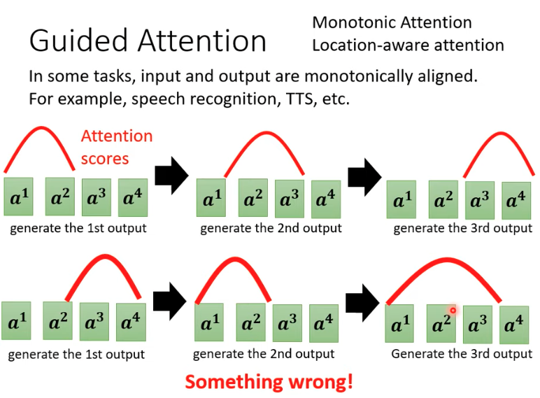

[【機器學習2021】Transformer (上)](https://www.youtube.com/watch?v=n9TlOhRjYoc&list=PLJV_el3uVTsMhtt7_Y6sgTHGHp1Vb2P2J&index=12&t=566s)

[【機器學習2021】Transformer (下)](https://www.youtube.com/watch?v=N6aRv06iv2g&list=PLJV_el3uVTsMhtt7_Y6sgTHGHp1Vb2P2J&index=13)

# Seq2Seq Model

* Input : sequence (a set of vector)
* Output : sequence (a set of vector)
* 語音辨識
  * In : 語音訊號
  * Out : 你好嗎? (長度無法確定)
* 機器翻譯
  * In : 某一國語言
  * Out : 另外一國語言，長度無法確定
* 語音翻譯
  * In : Machine Learning 的聲音訊號
  * Out : "機器學習"
  * 世界上有7000種語言不存在文字，且 end2end 可能計算得更快

</img>

# 台語語音轉繁體中文

母湯的聲音訊號 --> Model --> 不行

</img>

label : Youtube 上的台語影集，加上中文字幕

noisy

* 背景雜音?
* 不同人聲的口音?
* 台語音標?
* 如果都不管， Transformer baseline 還是表現得不錯

</img>

</img>

好與不好

好

* 多音節 --> 輸出音節數不同

不好

* 倒裝句
* 同樣聲音片段，容易聽成不同意思

# 中文文字 --> 台語聲音訊號
* Text to Speech (TTS) Synthesis

</img>

# NLP 使用上更加廣泛，理由是因為 seq2seq 幾乎是所有 Task 的母集合

</img>

Chat Bot (Question Answering) 幾乎是所有 NLP 問題的母集合

* QA - ok
* NER --> 給定一段文章，問他裡面的人是誰
* 文章摘要 --> 給定一段文章，問他總結
* 情緒辨識 --> 給定一段文章，問他正面還是負面
* QA 問題可以用 seq2seq 來解

</img>

* NLP 提供 Strong Baseline，但下游必須用其他不同的客製化模型，會做得更好

## Seq2seq 用於句法樹解析

Input : sequence
Output : parsing tree as a sequence (like programming language) - 2014, Dec

</img>

</img>

* 把 Grammar 當作一個語言，硬做，結果竟然是 SOTA
* 而且訓練時沒用什麼 tips，連 Adam 都沒有用， SGD 就 train 起來了
* 以文法來說，其實輸出類別非常之少

* 甚至圖片也可以轉換成 2D 文字

## Seq2seq for Multi-Label Classification

* 同個 Entity (Article) 屬於多個 class (例如多個 tags)
  * 如果用 Multi-class 解題，行不通的原因是，每一篇文章對應的 tags 數量可能是不同的

</img>

## Seq2Seq for Object Detection

</img>

* 輸出不知道是幾隻斑馬，就像是一個 Set of bounding box ， CV 也可以 end2end 用 transformer 解題

# Seq2seq

</img>

* 早期用的是 RNN， LSTM，現在用的是 Attention

# Encoder

</img>

* RNN, CNN, Self-attention 都可以作為 Encoder 的主要設計單元， Transformer 主要採用 Self-Attention

* 簡化版 - Transformer Encoder =  self-attention(含 positional encoder) + FeedForward Network (fc)
* 詳細版本 - self-attention + resudual + layer normalization + fc + resudual + layer normalization

</img>

</img>

* resudial 的意義 - 做過轉換的 vec 直接加上輸入的 vec，這樣優化的部分可以做少一點事情 --> 大量使用，意義為加速訓練收斂
* layer normalization
  * 輸入一個 vec，輸出一個 vec
  * 同一個 instance，不同 features 之間，做標準化, mean = 0, std = 1
* batch normalization
  * 考慮多個 samples, layer normalization 則更簡單一點

* 所以對應回去 paper 的圖， Add & Norm = residual + Layer Normalization

</img>

</img>

* 以上是 Transformer 預設架構，並非 optimal， layer normalization, residaul 的必要性，需要重複幾次等等，都是可以實驗的

# Decoder - Autoregressive (AT)

* Decoder 常見的有兩種，目前先介紹 Autoregressive 的 Decoder (AT)

* Encoder
  * Input 一段語音訊號(機器學習) 
  * Output - 一排向量 (和輸入向量數量相同)

</img>

</img>

* Decoder
  * 首先輸入 Begin of Sentense (BOS) - 特殊 Token
  * 輸出 - 你要輸出的目標語言
    * 中文 - 方塊字，常見的是 3k+ 個字，更多可以取到 8k+
    * 英文 - 顆粒度可以用字母、字根、單字等，取決於你對問題的理解
    * NOTE: 只要有目標數量過多，都需要做 Negtive Sampling Update
  * 推論階段
    * 得到 distribution as a vector --> softmax - 輸出機率最高的(也可以用別的)
    * 第一個輸出值作為 Context，繼續和 Encoder Embedding 協同計算，輸出第二個輸出值
  * **目前先忽略**
    * Encoder 的輸入如何影響 Decoder
    * Decoder 的一步錯，步步錯 (機器 --> 機 `氣` )

# 結構比較 - Encoder vs Decoder

* Decoder 和 Encoder 有其相似性
  * Encoder 的輸出會作為 Decoder 的輸入
  * Decoder 是 Masked-Self-Attention, Encoder 是 Self-Attention
  * Decoder 最終會經過線性層，並輸出 sequence (經由 softmax)

</img>

## Masked-Self-Attention

</img>

</img>

## Decoder 怎麼停下來?

PPT 有所謂的推文接龍，如果沒有人接 - **斷** ， 就不會有人停下來， special token (BEGIN, END 都要有)

* sequence 只能看先前的 Token，不能看未來的

</img>

# Decoder - Non Autoregressive (AT)

* 其實 Decoder 輸出，需要根據前一個字，也是所謂的序列化 (sequential) ， 這使得推論速度變慢 ， 有沒有辦法一次生成?
* 一次生成的結果目前還不夠好，是接下來的研究熱點(2021~)

* 輸出長度可控，例如 TTS 聲音合成，希望輸出人聲講快一點 (fast speech)
  
</img>

## How Decoder use Encoder output (Cross-Attention)

</img>

</img>

* Cross-Attention - decoder 要輸出句子，利用 encoder 的 key, value 產生 attention score, 送到接下來的 FC

* Cross-Attention + Self-Attention

</img>

* 以上是聲音辨識 (Speech Recognition)
* Cross Attention 在 Transformer 之前就有了，發展軌跡是 Cross Attention --> Self-Attention

* Deocder 一定要拿最後一層 Encoder 的輸出嗎? 因為 Encoder 會 Stack 好幾個 - 也可以不用，越複雜的網路有機會有越好的效果，也有機會 Overfitting

</img>

* 有 800 種 Cross Attention 的方式

# Training

* Label - 工讀生聽聲音打字
* loss func - cross entropy - Decoder 輸出的每一個 Token 是一個分類問題
* output - 以一個句子來說， 要 minimize output vs "機器學習。" 之間的 每一個 token vector 之間的 cross entropy 總和

</img>

</img>

## Teacher Forcing

Decoder 訓練時，事實上因為 seqences 的關係，必須

* 輸入 BEGIN, "機器學習"
* 輸出 "機器學習", END

稱之為 Teacher Forcing

然而，推論時不會看到正確答案，而是會將自己推論的結果是為正確答案，中間會有 mismatch

</img>

# Training seq2seq tips

## copy mechanism

* 輸出不需要創造新的，很多時候只是需要複製輸入的內容，這可以限縮訓練的難度
* e.g. chatbot

</img>

* 比起學習什麼是 "庫洛洛"，不如學習只要 User 輸入 我是XXX，就把XXX複製到輸出，這對 QA 很有幫助

* e.g. 文章摘要(Summarizer) - e.g. 輸入一篇文章，輸出標題，或者輸出一段描述
  * 通常需要百萬篇文章才夠 (企業通常是 small data)
  * 摘要的特性 - 通常從內容裡面都偏西湊，完全創造的部分有，但不會是全部

</img>

* 代表模型 - Pointer Network / Copy Network

## Guided Attention

聲音合成 (TTS)

發財發財發財發財 - 聲音訊號有抑揚頓挫

發財發財發財 - OK

發財發財 - OK

發財 - 死掉了，說不出兩個音節 (NN 很容易在意想不到的地方犯低級錯誤)

* 強迫機器一定要看到某些 token (hard attention)

</img>

* Attention 學習的效果出問題，需要透過特殊標記
* 代表模型 - Monotonic Attention, Location-aware attention

### Beam Search
* 假設只有兩種 Token 可以選，現在透過 Decoder 輸出 token

</img>

* Red Path - Greedy Decoding
* 雖然綠色路線的 B 一開始比較差，但總體其實比較好 - Beam Search 方法
* 沒辦法爆搜尋所有路徑 (複雜度過高) ，通常每個節點只能探索 TopK 
* 很多序列都是可以的解答 (Article Completion) --> Greedy Decoding 表現得好
  * 需要模型發揮一點創造力時
* 很少量，甚至只有一個標準答案 (Speech Recognition) --> Beam Search 表現得好
  * 需要模型輸出精確答案

### Optimization Evaluation Metrics

</img>

* 訓練的時候是一個一個 vector 做 cross entropy，驗證時其實用的是 BLEU Score，但是 BLEU 不可微分，所以很難在 Training 時當作 Loss function

* BLEU Score
  * 不可微分 - 需要 RL
  * 口訣 : 不可微分，無法優化， RL 硬做

### Exposure Bias

</img>

* 因為 Deocder 的輸入也會是自己先前的輸出，有可能一步錯，步步錯(和推薦系統的 feedback loop 很像)

* Scheduled Samping - Label 加入一些 Noise (例如"機器學習 --> 機氣學習")，做法也類似 Data Augmentation，讓模型更為 robust
  * Ground Truth 不具備唯一性

NLP 中稱為 scheulded samping 

* 代表模型 - Original Scheduled Samping / Scheduled Samping for Transformer / Parallel Scheduled Samping (2015 就有了)

</img>
