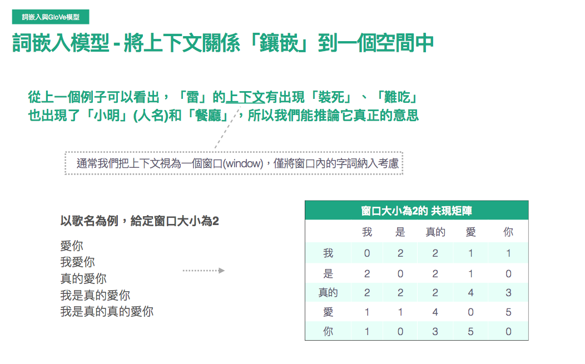
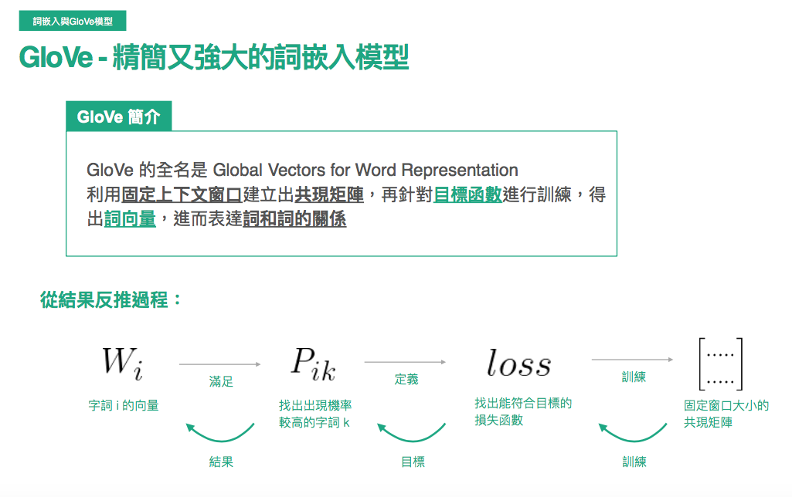
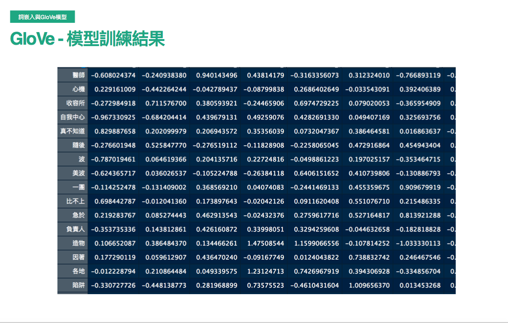
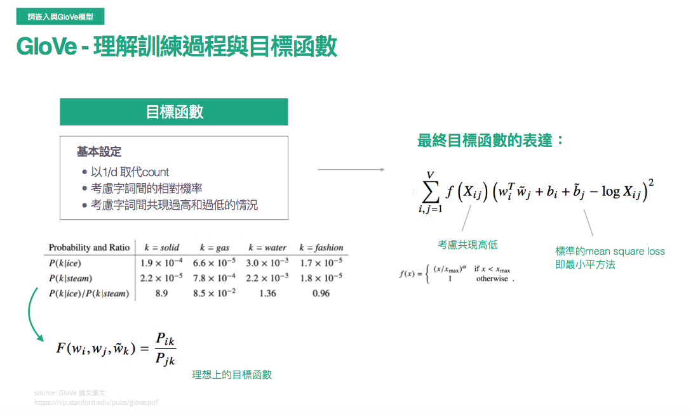

# word_embedding
* 大家最常聽到的可能是google發的word-embedding
* 但其實Glove有著較好的解釋性，並且實作上的性能也較word2vec要好一些
## Embedding
</img>
需求 : ngram以及貝氏推論的缺點 : 整個上下文的脈絡
E.g : 
1. 小明真的很雷，團體報告都裝死
2. 這間餐廳好雷，食物有夠難吃
其實我們無法從前面"小明真的很"以及"這間餐廳"來理解雷其實是負面的意思，反而要到後面"團體報告都裝死"，"食物有夠難吃"才能夠推論說:
雷這個字是在形容"小明"，"餐廳"，而且是不好的意思。
上下文模型就是遵從這個理念來進行設計，某個不認得的字，用上下文來推論其意思
窗口的大小(上下文的共現矩陣) - dense matrix，而非sparse matrix

## GloVe的模型設計
Global Vectors for Word Representation
透過固定上下文窗口建立貢獻矩陣，在針對目標函數進行訓練，得出詞向量，進而表達詞與詞之間的關係
</img>
以愛你舉例，**給定窗口大小為2**，我們可以看到**真的**現在包含了更多資訊，也從較為sparse的matrix進入到dense matrix，該矩陣可以做為一個labelled traning target $X_ij$
</img>
該模型的設計，把固定窗口大小的共現矩陣當作target
希望能夠找出k個當出現某個字時，後續出現字機率較高的，並且定義一個loss function

</img>
可以透過cos similarity來找出最相近的推薦字

</img>

* 訓練過程與目標函數
* 細節可以看論文，應該是還ok不會太難
* $\frac{1}{d}$取代counts : d為窗口大小，很合理，越靠近的字有越大的比重
* 考慮字詞之間的probability Ratio
* 字詞之間共現過高或過低的處理

[check 1](https://zhuanlan.zhihu.com/p/42073620)
[check 2](https://zhuanlan.zhihu.com/p/79573970)

# word2vec
[check here](https://zhuanlan.zhihu.com/p/26306795)
* 分為skip gram以及CBOW
* 

# Compare word2vec and Glove
