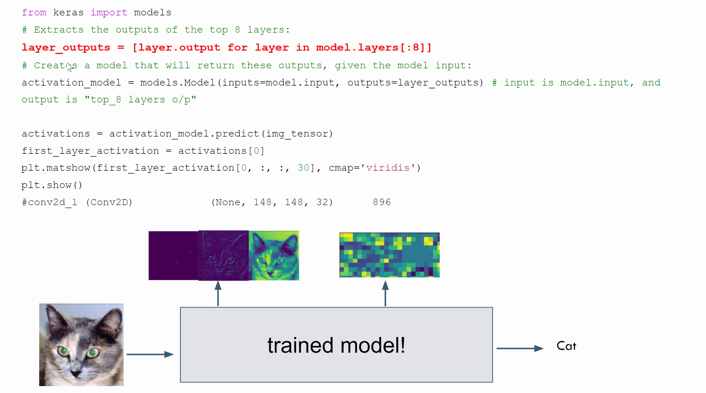
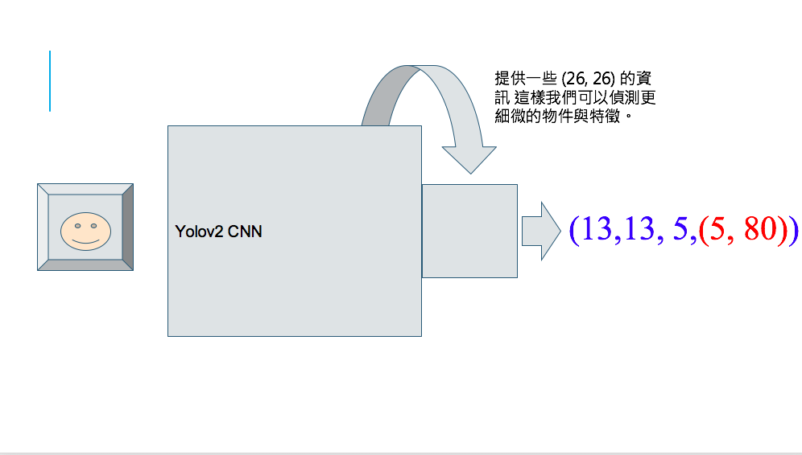

# source

* https://www.facebook.com/photo.php?fbid=3129279323855153&set=gm.1682237215262151&type=3&theater&ifg=1

* 作者傾向一起討論釣竿怎麼被設計出來的XD

## 重點

* 會拔出layer中間的output
* 會定義自己的loss function

* 鴻海 - 用darknet XD
* qqwweee - keras yolo....

## 開場

</img>

</img>

* 再次思考，從classfication / regression 到 object detection?

</img>

* 紅色這行告訴我們，可以把每一層的output map拿出來看，然後畫出來，看看發生什麼事

# pattern generation

* 把layer parameters固定，改output，看什麼時候值最高，反過來，**梯度上升**

</img>

## 物件偵測

* 這是貓還是狗XD

</img>

# 定義問題

* 用一個框框，然後左上角跟右下角
* 然後要有label 告訴我們是貓還狗，就這樣
* 整個Framework就這樣，開始!

* 右邊， rule base 上下1/2，上下左右1/4

* 拓展這個想法，切N格?
* 不要看不起學工科的XD

* 沒錯，在這個框架下，label要提供這些資訊

* 在單個格子內可以解決

* 跨格怎麼辦?
  + 左下角0, 0 跨格高3格，寬1格，從標籤下手
  + yolo最後抓到3隻貓(N隻貓)，最後再裁切出一隻 - NMS
* 在格子跟格子中間怎麼辦?
* 一格裡面超過一個動物怎麼辦?

</img>

</img>

* 定個loss 硬train一發
* 初步來說 - 這樣就可以XD
* train出來再慢慢調參數

* 採用中心點, W, H 可以大於1，所以標籤 $(W, H, x_c, y_c, cat_1, cat_2, ... , cat_n)$
* $4 \times 4 \times 1$表示有16個格子

</img>

* XD

</img>

* yolo的設計 每個grid還配置一個confience score(這個框預測的信心度有多高), 一個grid可以框兩個東西，但是要同個東西 - 這是當初設計上的缺陷

yolov2 - $13 \times 13 \times 5 \times 5 \times 80$ -> grid 13 x 13, 一格偵測5個物件，每個物件有x, y, w, h, confidence, 80個物件

* v3更扯XD

</img>

</img>

* filters 是幹嘛的?

</img>

</img>

</img>

* 把最終的解析度提高一點灌進去
  + 原本 13x13
  + 把26x26的資料切4格灌進去 - yolov2叫做fine grane
  + yolov3不是fine grane
* 1/13可以偵測3個物件，但是有26x26, 52x52 總和一格可以偵測63個物件

# 怎麼設計confidence score

</img>
</img>

* softmax可以當作一個極化器

# NMS

* 因為要解決跨grid偵測物件，一個grid裡面有多個物件的問題，一個ground truth可能被框出10個以上的框，因此我們需要來選框框

# Anchor在幹嘛?

</img>

</img>

* 透過統計長寬比，來推測新的預測是不是合理，差太多就認為是一個不合理的推測

* 例如羽毛球拍跟曬衣桿，長寬比極度誇張，用pre train model，偵測得很差
* 於是乎就先用心的anchor，重新統計一下你的training set ground truth的長寬比，per class的anchor長寬比進行統計，
* 但是目前來說還不是很確定對不對，需要在考究一下

# Yolo v1, v2, v3

</img>

# Yolov2很努力

</img>
</img>

* Fine Grained Feature，把26x26 切成4塊灌進去13x13，變成一個較大的vector來train

# Yolov3 很閒

</img>

* yolov3 downsample 到 13x13 在upsampling上去，跟原本的concat(基本上是FPN結構)，多尺度訓練方法
* 所以v3接到NN是多尺度的，才會有那麼多 (13x13x3 + 26x26x3 + 52x52x3) x (5 x 80)

* 坦白說如果想看code，去看qqwweee，keras的code基本上都有寫

# 設計比較

</img>
</img>

# Code & ptt

https://www.facebook.com/groups/774141029405112/permalink/1686940711458468/

基本上是fork qqwweee

https://drive.google.com/drive/u/1/folders/1Dqm6SiuJ9zfI3f2MGpGiY7TUwThLJ66P

需要我的密碼
